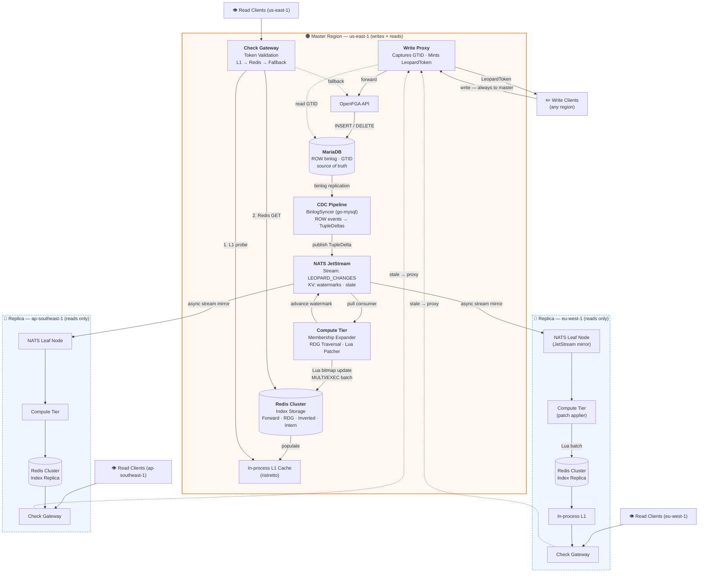
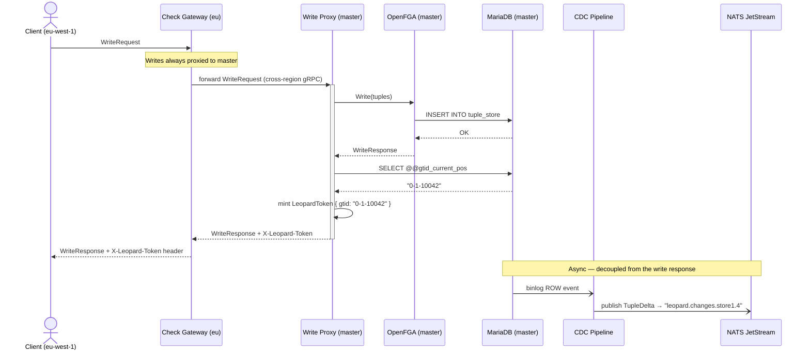
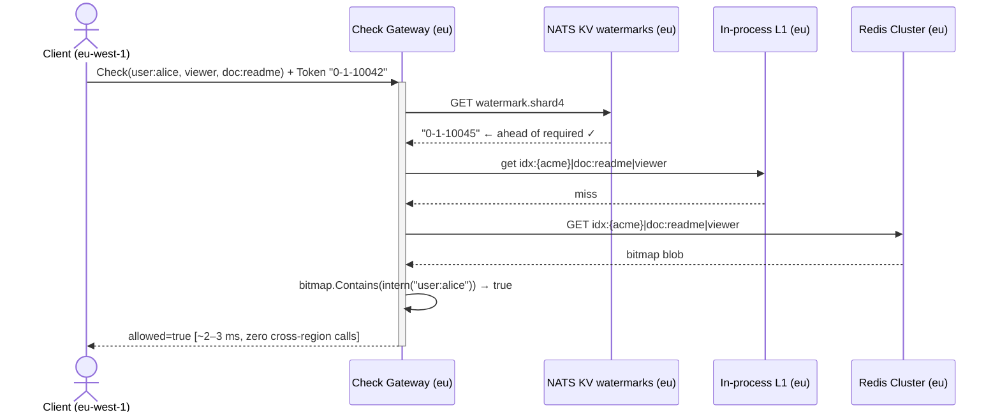
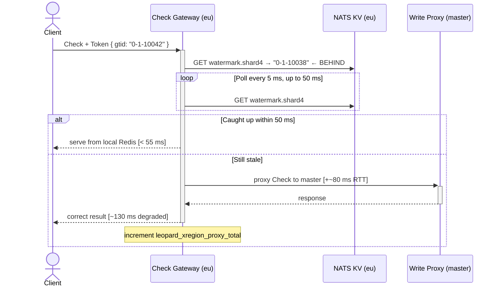
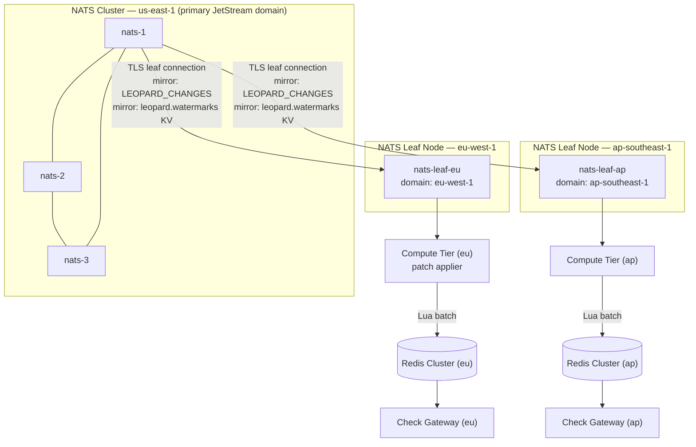
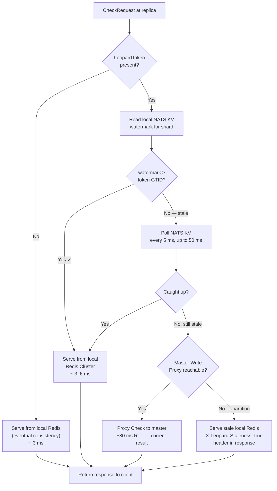

# Leopard Indexing System for OpenFGA

> **RFC-LPD-005** · Status: `FINAL` · Language: `Go` · v5.0.0
>
> **Changes from v4:** Index storage is now **Redis Cluster only** (Pebble removed).
> This requires new key naming conventions, a hash-tag co-location strategy for
> atomicity, and an explicit inverted index for `ListObjects` (previously a free
> prefix scan on the LSM).

---

## Table of Contents

1. [The Core Problem](#1-the-core-problem)
2. [Design Goals](#2-design-goals)
3. [Architecture Overview](#3-architecture-overview)
4. [Topology: Write-Only Master, Read-Only Replicas](#4-topology-write-only-master-read-only-replicas)
5. [Index Design](#5-index-design)
   - 5.1 [What Is Precomputed](#51-what-is-precomputed)
   - 5.2 [Redis Key Naming & Hash Tags](#52-redis-key-naming--hash-tags)
   - 5.3 [Redis Data Structures per Namespace](#53-redis-data-structures-per-namespace)
   - 5.4 [Value Encoding — Roaring Bitmap Member Sets](#54-value-encoding--roaring-bitmap-member-sets)
   - 5.5 [The Reverse Dependency Graph (RDG)](#55-the-reverse-dependency-graph-rdg)
   - 5.6 [The Inverted Index — Required by Redis](#56-the-inverted-index--required-by-redis)
   - 5.7 [Sharding Strategy](#57-sharding-strategy)
6. [Algorithms](#6-algorithms)
   - 6.1 [Check — Read Path](#61-check--read-path)
   - 6.2 [ListObjects — Inverted Index Lookup](#62-listobjects--inverted-index-lookup)
   - 6.3 [Apply Delta — Write Path](#63-apply-delta--write-path)
   - 6.4 [Atomicity: Lua Scripts + MULTI/EXEC](#64-atomicity-lua-scripts--multiexec)
   - 6.5 [RDG Propagation](#65-rdg-propagation)
   - 6.6 [Bootstrap — Full Re-Index](#66-bootstrap--full-re-index)
7. [Change Data Capture Pipeline](#7-change-data-capture-pipeline)
8. [Consistency Model](#8-consistency-model)
9. [Multi-Cluster Replication](#9-multi-cluster-replication)
10. [Failure Modes & Resilience](#10-failure-modes--resilience)
11. [Operations & Observability](#11-operations--observability)
12. [Performance Targets](#12-performance-targets)
13. [Repository Layout & Dependencies](#13-repository-layout--dependencies)

---

## 1. The Core Problem

OpenFGA resolves `Check(user, relation, object)` by **recursively expanding** the
authorization model at query time. For a tuple chain like:

```
document:readme#viewer  @  group:eng#member
group:eng#member        @  group:backend#member
group:backend#member    @  user:alice
```

Answering *"can alice view readme?"* requires traversing every level — three
separate database round-trips in this example. For organizations with 8-level
nested groups and millions of users this compounds into **50–100 ms p99 latency**
and significant database load.

**Leopard solves this by precomputing the answer.** For every `(object, relation)`
pair, Leopard maintains the complete transitive set of leaf users who hold that
relation — updated incrementally as tuples change. A `Check` becomes a **single
Redis bitmap lookup** instead of a recursive database traversal.

---

## 2. Design Goals

| # | Goal |
|---|------|
| G1 | `Check` p99 latency **< 5 ms** regardless of group nesting depth |
| G2 | Reads served **fully locally** in every region — no cross-region RTT on the read path |
| G3 | **Read-your-own-writes** guarantee via a lightweight `LeopardToken` |
| G4 | Index kept fresh within **< 500 ms** of a tuple write under normal conditions |
| G5 | **Zero changes to OpenFGA's API surface** — Leopard is a transparent sidecar layer |
| G6 | Graceful degradation to OpenFGA's native recursive expander at every failure boundary |
| G7 | All index state stored exclusively in **Redis Cluster** — no separate embedded KV |

---

## 3. Architecture Overview



### Processing stages

1. **Write Proxy** — transparently forwards writes to OpenFGA, captures the resulting
   MariaDB GTID, and mints a `LeopardToken` returned to the caller.
2. **CDC Pipeline** — acts as a MariaDB replication slave, consuming ROW-format binlog
   events and publishing each row change as a `TupleDelta` to NATS JetStream.
3. **Compute Tier** — pull consumers on NATS JetStream, one per logical shard. Applies
   `TupleDelta` messages by executing Lua scripts against Redis (bitmap
   union/difference), propagating changes upward through the RDG, and updating the
   inverted index — all in a single `MULTI/EXEC` batch per delta set.
4. **Redis Cluster** — the sole index store. Holds four namespaces: the forward index
   (member bitmaps), the RDG, the inverted index (for `ListObjects`), and the user
   intern table. All keys for a given store share a hash tag ensuring slot co-location
   and enabling cross-key transactional writes.
5. **Check Gateway** — validates the caller's `LeopardToken` against the NATS KV
   watermark, probes an in-process L1 cache, then falls through to a Redis `GET`,
   and degrades to OpenFGA recursive expansion only as a last resort.

> [!NOTE]
> **L1 cache vs the old Redis hot cache:** In v4, Redis served as a hot cache in
> front of Pebble. With Redis now being the index store itself, an in-process L1
> cache (`ristretto`) serves as a true L1 layer that avoids the Redis network RTT
> for the absolute hottest entries. There is no longer a two-tier cache — the L1
> sits directly in front of Redis.

---

## 4. Topology: Write-Only Master, Read-Only Replicas

Authorization systems are **read-dominated** — typical read-to-write ratios are
100:1 to 1000:1. Making writes slightly slower (one extra cross-region RTT) to make
reads fast everywhere is the correct trade.

```
Write latency added (replica region):  +60–120 ms cross-region RTT   ← acceptable
Read latency saved (all regions):      −50 to −100 ms per Check       ← the whole point
```

### Write flow (any region → master)



### Read flow (fully local — no cross-region)



### Stale read handling



---

## 5. Index Design

### 5.1 What Is Precomputed

The Leopard index stores the **transitive closure** of every authorization
relationship. For every `(object, relation)` pair, the index precomputes the
complete flat set of **leaf users** who hold that relation on that object — whether
through a direct tuple, a computed userset, or a tuple-to-userset chain.

```
idx:{acme}|document:readme|viewer  →  Bitmap{ alice, bob, carol }
idx:{acme}|group:eng|member        →  Bitmap{ alice, bob, carol, dan }
idx:{acme}|org:acme|member         →  Bitmap{ alice, bob, carol, dan, eve }
```

This transforms a recursive graph traversal into a single **Redis `GET` + bitmap
`Contains`** call.

**What is not precomputed:**

- **Condition-gated tuples** — conditions are evaluated at runtime against a request
  context and cannot be precomputed.
- **Wildcard relations** (`user:*`) — stored as a reserved sentinel user ID
  `0xFFFFFFFF`, recognized immediately during lookup.

### 5.2 Redis Key Naming & Hash Tags

Redis Cluster routes keys using `CRC16(key) mod 16384`. Without intervention, two
keys for the same store could land on different cluster nodes, making a
cross-key atomic write impossible.

The solution is **hash tags**: the portion of a key name enclosed in `{braces}` is
the only part used for slot assignment. By using `{store_id}` as the hash tag in
every key, all four namespaces for a given store always land on the same Redis node,
enabling `MULTI/EXEC` across them.

**Key naming pattern:**

```
{namespace}:{store_id}|{rest}
```

The `|` pipe character is the field separator within the rest of the key. It is
chosen because it never appears in OpenFGA object types, object IDs, or relation
names, making it safe to split on.

**Concrete examples for store `acme`:**

```
idx:{acme}|document:readme|viewer        ← forward index entry
idx:{acme}|group:eng|member              ← forward index entry (a group)
rdg:{acme}|group:eng|member              ← RDG entry
inv:{acme}|0|viewer                      ← inverted index (user intern ID 0)
wm:{acme}|shard4                         ← GTID watermark for shard 4
```

All five keys hash on `acme` → same CRC16 → same cluster slot → same Redis node.

### 5.3 Redis Data Structures per Namespace

| Namespace prefix | Redis type | Content | Operation |
|---|---|---|---|
| `idx:{store}\|obj\|rel` | `STRING` | Serialized Roaring Bitmap | `GET` / Lua update |
| `rdg:{store}\|obj\|rel` | `SET` | Dependent key strings | `SADD` / `SREM` / `SMEMBERS` |
| `inv:{store}\|uid\|rel` | `SET` | Object key strings | `SADD` / `SREM` / `SMEMBERS` |
| `intern:{store}` | `HASH` | field=user\_string val=uint32 | `HGET` / `HSETNX` |
| `wm:{store}\|shardN` | `STRING` | GTID watermark | `SET` / `GET` |

The `intern:{store}` key is a single Redis `HASH` per store rather than one key per
user string. This reduces key count by millions for large stores and allows a single
`HGETALL` to load the full intern table into the Compute Tier's in-process memory
on startup.

### 5.4 Value Encoding — Roaring Bitmap Member Sets

Each `idx:` key's value is a serialized **Roaring Bitmap** — a compressed bitset
representation operating on `uint32` user IDs.

**Why bitmaps, not Redis native sets?**

A Redis `SADD` set holding 1 million user strings costs ~50 MB. A Roaring Bitmap of
1 million user IDs costs ~125 KB — a 400× reduction. More importantly, set union and
difference (the core operations during RDG propagation) run at SIMD speed on the
bitmap's word array rather than requiring a Redis `SUNIONSTORE` that would need to
transfer and merge entire keyspace sets over the network.

The bitmap operates on `uint32` user IDs rather than strings. The **user intern
table** (`intern:{store}` HASH) maps each user string to a compact `uint32`. This
indirection is what makes the bitmap compact: the 36-byte string `user:alice@corp.com`
becomes the 4-byte integer `0`.

**Bitmap serialization:** Roaring Bitmaps self-describe their internal container
type per 2^16 chunk of the ID space:

- **Array container** — sparse chunks (< 4096 values): 2 bytes per user ID.
- **Bitmap container** — dense chunks (≥ 4096 values): fixed 8 KB, ~0.001 bytes
  per user ID.
- **Run-length container** — clustered values: pairs of `(start, length)`.

The serialized bitmap is stored directly as the Redis `STRING` value. Redis treats
it as an opaque blob; all deserialization and set operations happen in the Compute
Tier's in-process memory, not on the Redis server (with the exception of the Lua
script that fetches, mutates, and stores in one atomic round-trip — see §6.4).

### 5.5 The Reverse Dependency Graph (RDG)

The RDG answers: *"if the member set of `(A, r1)` changes, which other index
entries must also be updated?"*

Each `rdg:{store}|obj|rel` key is a Redis `SET` of dependent `idx:` key strings. An
edge `(group:eng, member) → (document:readme, viewer)` means the document's viewer
bitmap includes the group's member bitmap as a sub-component, so any change to the
group's members must propagate to the document's viewers.

**Example RDG entries:**

```
rdg:{acme}|group:eng|member  →  SET {
    "idx:{acme}|document:readme|viewer",
    "idx:{acme}|document:spec|viewer",
    "idx:{acme}|org:acme|member"
}

rdg:{acme}|org:acme|member   →  SET {
    "idx:{acme}|document:plan|viewer",
    "idx:{acme}|document:budget|viewer"
}
```

When `user:alice` is added to `group:eng#member`, the Compute Tier reads the RDG
SET for `group:eng|member`, then for each dependent reads its own RDG SET, walking
upward recursively until no more dependents exist — then writes all affected bitmaps
in one `MULTI/EXEC` batch.

**Critical invariant:** The RDG must be updated in the same `MULTI/EXEC` block as
the index entry it describes. An inconsistent RDG silently produces stale member
sets with no error signal.

### 5.6 The Inverted Index — Required by Redis

In the Pebble version, `ListObjects` (find all objects user:alice can view) was
implemented as a **prefix scan** on the `'I'` keyspace — Pebble's LSM supports
ordered iteration, so scanning all keys starting with `I|acme|document:` returned
every document entry in one pass.

Redis has no equivalent. `SCAN MATCH` is a full-keyspace cursor that inspects every
key — it is O(N) across the entire Redis keyspace and cannot be used for production
lookups.

The replacement is an **explicit inverted index**: for each `(user_id, relation)`
pair, a Redis `SET` contains every object key that user holds that relation on. The
Compute Tier writes to both the forward index and the inverted index simultaneously
on every `TupleDelta`.

**Forward direction (Check):**

```
GET idx:{acme}|document:readme|viewer
→  bitmap.Contains(intern("user:alice"))
→  true / false
```

**Inverse direction (ListObjects):**

```
userId ← HGET intern:{acme} "user:alice"   → 0
SMEMBERS inv:{acme}|0|viewer
→ {"idx:{acme}|doc:readme|viewer",
   "idx:{acme}|doc:spec|viewer",
   "idx:{acme}|doc:plan|viewer"}
```

**Inverted index maintenance on every delta:**

- `INSERT (doc:readme, viewer, user:alice)` → `SADD inv:{acme}|0|viewer "idx:{acme}|doc:readme|viewer"`
- `DELETE (doc:readme, viewer, user:alice)` → `SREM inv:{acme}|0|viewer "idx:{acme}|doc:readme|viewer"`

Because bitmap propagation through the RDG can add a user to many objects at once,
the Compute Tier accumulates all `SADD`/`SREM` operations for the inverted index
across the entire RDG walk and includes them in the same `MULTI/EXEC` batch.

### 5.7 Sharding Strategy

The index is sharded using **rendezvous hashing** (highest-random-weight hashing)
over the composite key `store_id + object_id`. This ensures:

- All relations of a given `(store, object)` are on the same Leopard shard —
  enabling multi-relation batch reads in a single network hop.
- Reshuffling is minimal when shard count changes (only 1/N keys move when one
  shard is added), unlike consistent hashing with virtual nodes.

The shard ID is embedded in the NATS subject as `leopard.changes.{storeId}.{shardId}`,
so each Compute Tier instance only consumes messages destined for its own shards.

> [!IMPORTANT]
> **Leopard shards ≠ Redis Cluster slots.** The Leopard shard is a logical
> partition of the NATS consumer group — it controls which Compute Tier instance
> processes which messages. Redis Cluster slots are a physical routing concern
> determined entirely by hash tags. These two partitioning schemes are independent.
> All keys for store `acme` always land on the same Redis slot regardless of which
> Leopard shard generated the update.

---

## 6. Algorithms

### 6.1 Check — Read Path

```
Algorithm: Check(user, relation, object, token?)

1.  If consistency == FULL_CONSISTENCY:
      delegate to OpenFGA recursive expander. Return.

2.  If token is present:
      shardId  ← ShardOf(object, relation)
      currGTID ← Redis.GET("wm:{store}|shard{shardId}")
      If NOT gtidGeq(currGTID, token.GTID):
        goto STALE_HANDLING

3.  L1 PROBE (in-process ristretto cache):
      key ← "idx:{store}|{object}|{relation}"
      If L1.Get(key) → members:
        goto MEMBERSHIP_TEST

4.  REDIS LOOKUP:
      members ← Redis.GET(key)   // fetches serialized bitmap
      If nil:
        Metrics.fallback("not_indexed")++
        delegate to OpenFGA recursive expander. Return.
      deserialize bitmap
      L1.Set(key, members, TTL=30s)

5.  MEMBERSHIP_TEST:
      If members.ContainsWildcard():   // sentinel 0xFFFFFFFF
        return allowed=true
      userId ← Redis.HGET("intern:{store}", user)
      return allowed = members.Contains(userId)

STALE_HANDLING:
      deadline ← now + 50ms
      while now < deadline:
        sleep(5ms)
        currGTID ← Redis.GET("wm:{store}|shard{shardId}")
        If gtidGeq(currGTID, token.GTID):
          goto step 3
      Metrics.xRegionProxy++
      proxy request to master Write Proxy. Return.
```

Hot path cost: one L1 lookup (in-process, < 0.1 ms) + one Redis `GET` on miss
(~0.5–1 ms round-trip) + one Redis `HGET` for user intern lookup = **< 3 ms total
in steady state**.

### 6.2 ListObjects — Inverted Index Lookup

```
Algorithm: ListObjects(user, relation, objectType)

1.  userId ← Redis.HGET("intern:{store}", user)
    If nil: return empty   // user has no memberships

2.  objKeys ← Redis.SMEMBERS("inv:{store}|{userId}|{relation}")
    // e.g. {"idx:{acme}|document:readme|viewer", "idx:{acme}|document:spec|viewer"}

3.  Filter by objectType (prefix match on the key string after "idx:{store}|"):
    objKeys ← [k for k in objKeys if keyObjectType(k) == objectType]

4.  Return [extractObjectRef(k) for k in objKeys]
    // e.g. ["document:readme", "document:spec"]
```

The cost is one Redis `HGET` + one `SMEMBERS` — both O(1) and O(members of the
result set) respectively. No full-keyspace scan is performed.

### 6.3 Apply Delta — Write Path

```
Algorithm: ApplyDelta(delta: TupleDelta)

1.  If delta.conditionName is not empty:
      skip — conditional tuples are not indexed. Return.

2.  INTERN USER:
      userId ← Redis.HGET("intern:{store}", delta.user)
      If nil:
        userId ← Redis.HINCRBY("intern:{store}", "__next__", 1)
        Redis.HSETNX("intern:{store}", delta.user, userId)

3.  RESOLVE AFFECTED USER SET:
      If delta.user contains '#' (userset ref, e.g. "group:eng#member"):
        refKey    ← "idx:{store}|{group_obj}|{group_rel}"
        refBitmap ← Redis.GET(refKey) → deserialize
        affectedIDs ← refBitmap
      Else:
        affectedIDs ← SingletonBitmap(userId)

4.  ACCUMULATE BATCH:
      targetKey ← "idx:{store}|{delta.object}|{delta.relation}"
      batch.addBitmapUpdate(targetKey, delta.op, affectedIDs)
      batch.addInvertedUpdate(delta.op, affectedIDs, targetKey)
      batch.addRDGUpdate(delta)       // if userset ref, ensure RDG edge exists

5.  PROPAGATE (Algorithm 6.5):
      PropagateRDG(targetKey, delta.op, affectedIDs, batch, depth=0)

6.  COMMIT (Algorithm 6.4):
      ExecuteBatch(batch)

7.  Redis.SET("wm:{store}|shard{shardId}", delta.GTID)
    NATS.Ack(message)
```

### 6.4 Atomicity: Lua Scripts + MULTI/EXEC

In the Pebble design, atomicity came from `WriteBatch.Commit()` — a single fsync
covering any number of keys. Redis has no equivalent multi-key atomic write unless
all keys share the same hash slot. Hash tags (§5.2) ensure this is always true for
a given store.

The batch execution uses two Redis primitives in combination:

**Lua script for individual bitmap mutation** — executed atomically on the Redis
server with `EVALSHA`. The script fetches the current serialized bitmap, applies the
union or difference in-script, then writes the result back. This eliminates the
read-modify-write race that would exist if `GET`, mutate in Go, `SET` were three
separate commands.

```lua
-- KEYS[1]: target bitmap key
-- ARGV[1]: "union" or "diff"
-- ARGV[2]: serialized bitmap of affected user IDs

local current = redis.call("GET", KEYS[1])
local result  = bitmap_apply(current, ARGV[1], ARGV[2])
redis.call("SET", KEYS[1], result)
return result
```

**MULTI/EXEC for the batch** — wraps all Lua `EVALSHA` calls, `SADD`/`SREM` calls
on the RDG and inverted index SETs, and the watermark `SET` into one atomic block.
Because all keys share the same hash tag (same slot, same node), Redis executes the
entire block without interleaving commands from other clients.

```
MULTI
  EVALSHA <bitmap_sha> 1 idx:{acme}|doc:readme|viewer "union" <bitmap_bytes>
  EVALSHA <bitmap_sha> 1 idx:{acme}|doc:spec|viewer   "union" <bitmap_bytes>
  SADD rdg:{acme}|group:eng|member "idx:{acme}|doc:readme|viewer"
  SADD inv:{acme}|0|viewer "idx:{acme}|doc:readme|viewer"
  SADD inv:{acme}|0|viewer "idx:{acme}|doc:spec|viewer"
EXEC
```

This gives the same all-or-nothing guarantee as the previous Pebble `WriteBatch`,
with the added benefit that a Redis `EXEC` failure (e.g. `WATCH` collision) can be
retried without partial state.

### 6.5 RDG Propagation

```
Algorithm: PropagateRDG(changedKey, op, affectedIDs, batch, depth)

1.  If depth > MAX_DEPTH (= 12):
      CIRCUIT BREAKER:
        Redis.SADD("dirty:{store}", changedKey + "|" + currentGTID)
        Metrics.circuitBreakerFired++
        Return

2.  dependents ← Redis.SMEMBERS("rdg:{store}|{obj}|{rel}")
      // extracted from changedKey

3.  For each depKey ∈ dependents:

      a.  batch.addBitmapUpdate(depKey, op, affectedIDs)

      b.  For each affectedUserId ∈ affectedIDs:
            If op == INSERT:
              batch.addInverted(SADD, "inv:{store}|{uid}|{rel}", depKey)
            If op == DELETE:
              batch.addInverted(SREM, "inv:{store}|{uid}|{rel}", depKey)

      c.  PropagateRDG(depKey, op, affectedIDs, batch, depth+1)
```

All modifications accumulate into the same `batch` object and are committed together
in one `MULTI/EXEC` block at the end of `ApplyDelta`. The circuit breaker at depth
12 prevents unbounded recursion — entries that hit it are placed in the
`dirty:{store}` Redis SET and re-derived asynchronously.

### 6.6 Bootstrap — Full Re-Index

Required when Leopard is first deployed or when the OpenFGA authorization model
changes.

```mermaid
sequenceDiagram
    participant OPS as Operator
    participant BS  as Bootstrap Job
    participant DB  as MariaDB
    participant KV  as NATS KV
    participant SHA as Shadow Redis (separate cluster key prefix)
    participant PRD as Production Redis

    OPS->>BS: trigger bootstrap --store-id=acme
    BS->>DB: SELECT @@gtid_current_pos → L_start
    BS->>KV: PUT state.bootstrap.acme = L_start
    Note over BS: Record GTID before scan begins.<br/>All changes after this point will be replayed.

    par Stream existing tuples
        BS->>DB: paginated SELECT * FROM tuple_store WHERE store_id='acme'
        DB-->>BS: pages of 1 000 rows
        BS->>SHA: ApplyDelta → Lua bitmap updates → MULTI/EXEC<br/>writes to shadow prefix "sidx:{acme}|..."
    and Buffer new deltas
        Note over KV: CDC continues publishing deltas to NATS.<br/>Compute Tier buffers them; does NOT<br/>apply to production Redis yet.
    end

    BS->>BS: replay buffered deltas onto shadow prefix
    BS->>PRD: RENAME sidx:{acme}|* → idx:{acme}|*<br/>(atomic per-key; pipeline all renames)
    BS->>KV: DELETE state.bootstrap.acme
    BS->>OPS: bootstrap complete ✓
```

> [!NOTE]
> Redis has no atomic multi-key rename equivalent to Pebble's column-family swap.
> The bootstrap uses a **shadow prefix** (`sidx:`, `srdg:`, `sinv:`) and pipelines
> `RENAME` commands for each key after the shadow index is fully built. During the
> rename window, the Check Gateway degrades to OpenFGA recursive expansion. The
> window is typically < 1 second for stores with < 10 million index entries.

---

## 7. Change Data Capture Pipeline

### MariaDB configuration

```ini
# /etc/mysql/my.cnf
[mysqld]
binlog_format    = ROW          # mandatory — exact per-row before/after values
binlog_row_image = FULL         # include all columns in row images
gtid_strict_mode = ON           # deterministic GTID ordering
server_id        = 1
expire_logs_days = 7
```

```sql
CREATE USER 'leopard_cdc'@'%' IDENTIFIED BY '<strong-password>';
GRANT REPLICATION SLAVE, REPLICATION CLIENT ON *.* TO 'leopard_cdc'@'%';
```

### NATS JetStream subject hierarchy

```
leopard.changes.{storeId}.{shardId}   ← TupleDelta events (WorkQueue retention)
leopard.watermarks.{shardId}          ← KV: per-shard GTID watermark
leopard.state.cdc                     ← KV: last committed binlog GTID (resumption)
leopard.dirty.{storeId}               ← KV: keys queued for async re-derive
```

### TupleDelta

```
TupleDelta {
    op:            INSERT | DELETE
    storeId:       string
    objectType:    string          // "document", "group", "org"
    objectId:      string          // "readme", "eng", "acme"
    relation:      string          // "viewer", "member", "owner"
    user:          string          // "user:alice"  OR  "group:eng#member"
    conditionName: string          // non-empty → skip indexing
    gtid:          string          // MariaDB GTID e.g. "0-1-10042"
    msgId:         string          // NATS dedup: sha256(storeId+GTID+rowPK)
}
```

The `msgId` is set as the `Nats-Msg-Id` header on every publish. NATS JetStream's
built-in 60-second deduplication window silently discards any re-published message
with the same ID — making CDC pipeline restarts safe without application-level
idempotency logic.

### NATS JetStream vs Kafka

| Concern | Kafka | NATS JetStream |
|---|---|---|
| Ordering guarantee | Per-partition key | Per-subject; `MaxInFlight=1` for strict order |
| Deduplication | Idempotent producer + transactions | Built-in `Duplicates` window + `Nats-Msg-Id` |
| Watermark store | External (ZooKeeper, Consul, DB) | **NATS KV bucket** — no extra service |
| Cross-region replication | MirrorMaker 2 | **Leaf Nodes + stream mirroring** — native |
| Consumer model | Push (poll loop) | **Pull** — shard controls its pace |
| Back-pressure | Consumer lag metric, manual | `MaxAckPending` on consumer config |
| Operational footprint | ZooKeeper/KRaft + Kafka | Single `nats-server` binary |

---

## 8. Consistency Model

> [!IMPORTANT]
> OpenFGA has **no Zookie**. Zookies are specific to Authzed/SpiceDB. OpenFGA's
> `Check` API accepts a `consistency` enum (`MINIMIZE_LATENCY` or
> `HIGHER_CONSISTENCY`) but carries no client-readable consistency token. The
> `LeopardToken` is a **Leopard-layer addition only** and does not modify OpenFGA's
> API.

### LeopardToken

Returned from the Write Proxy in the `X-Leopard-Token` response header after every
write. Contains:

```
LeopardToken {
    gtid:    string    // MariaDB GTID of the committed write, e.g. "0-1-10042"
    shardWV: []uint64  // per-shard watermark vector snapshot at write time
    hlc:     uint64    // Hybrid Logical Clock — cross-region ordering
    storeId: string    // scoped to one OpenFGA store
}
```

Serialized as proto → base64url, safe for HTTP headers and gRPC metadata.

### Watermark tracking

Each Compute Tier shard writes `Redis.SET("wm:{store}|shard{N}", currentGTID)` after
every successfully committed `MULTI/EXEC` batch. Watermarks are also stored in the
NATS KV bucket `leopard.watermarks` and mirrored to replica regions via JetStream
stream mirroring — so the Check Gateway's token validation reads remain fully local.

### Consistency mode matrix

| OpenFGA consistency | Token present | Leopard behavior | p99 target |
|---|---|---|---|
| `MINIMIZE_LATENCY` | No | Serve from local Redis as-is (bounded staleness) | **< 3 ms** |
| `MINIMIZE_LATENCY` | Yes | Validate GTID; poll ≤ 50 ms; proxy master if stale | **< 6 ms** |
| `HIGHER_CONSISTENCY` | No | Read global high-watermark from NATS KV; serve at that snapshot | **< 7 ms** |
| `HIGHER_CONSISTENCY` | Yes | Full GTID + watermark validation before serving | **< 10 ms** |
| `FULL_CONSISTENCY` | Either | Bypass Leopard entirely; delegate to OpenFGA recursive expand | 20–80 ms |

> [!NOTE]
> Latency targets are ~1–2 ms higher than the Pebble version because Redis adds a
> network RTT (~0.5–1 ms on a local cluster) that Pebble's in-process reads did not.
> The L1 in-process cache (`ristretto`) recovers most of this for hot entries.

---

## 9. Multi-Cluster Replication

### Index patch streaming

Leopard streams **already-computed index patches** (not raw tuples) to replica
regions. Replica Compute Tier instances are pure patch appliers — they receive
pre-computed `(redisKey, bitmapDelta)` pairs and apply the same Lua mutation
script against their local Redis Cluster.

The patch stream reuses the same NATS JetStream `LEOPARD_CHANGES` stream, mirrored
to each replica region's NATS Leaf Node via JetStream stream mirroring.

### NATS Leaf Node topology



### Leaf Node configuration

```hcl
# deploy/nats/leaf-eu.conf

leafnodes {
  remotes = [{
    urls:        ["nats-leaf://nats-cluster.us-east-1.internal:7422"]
    credentials: "/etc/nats/leaf-eu.creds"
    tls { ca_file: "/etc/nats/ca.pem" }
  }]
}

jetstream {
  store_dir: "/data/nats"
  domain:    "eu-west-1"
  max_mem:   "4GB"
  max_file:  "500GB"
}
```

### Cross-region failover decision tree



---

## 10. Failure Modes & Resilience

| Condition | Detection | Automatic Mitigation |
|---|---|---|
| Replica lag > 500 ms | `leopard_replica_lag_seconds` alert | Route `HIGHER_CONSISTENCY` checks to master proxy |
| Master Write Proxy unreachable | gRPC health probe timeout | Writes blocked globally; replica reads continue (eventual) |
| NATS leaf node partition | JetStream mirror lag spike | Token checks proxy to master; no-token checks serve local Redis |
| Redis Cluster node failure | Redis client error rate spike | Redis Cluster auto-fails over to replica node; read continues after ~1–3 s election |
| Redis Cluster memory exhausted | `used_memory` → `maxmemory` | Keys evicted per policy (must use `noeviction` for index keys — see §11) |
| Auth model changed | `model_id` mismatch detected on read | Bootstrap job triggered; OpenFGA recursive expand served during rebuild |
| RDG cascade storm | `leopard_rdg_depth_max > 10` | Circuit breaker at depth 12; `dirty:{store}` SET queued for async re-derive |
| CDC pipeline restart | GTID loaded from `leopard.state` NATS KV | BinlogSyncer resumes from last GTID; NATS dedup prevents duplicate application |
| L1 cache stale | TTL expiry (30 s) | L1 miss → Redis `GET` → fresh value; no correctness impact |

### Redis Cluster memory management

> [!WARNING]
> Redis index data must not be evicted. All Redis Cluster nodes serving the Leopard
> index **must** be configured with `maxmemory-policy noeviction`. If Redis runs out
> of memory, `MULTI/EXEC` writes will fail with `OOM` errors — which Leopard treats
> as a batch error, triggers Nak, and eventually degrades to fallback. Configure
> `maxmemory` to 80% of available RAM to leave headroom for replication buffers.

---

## 11. Operations & Observability

### Go runtime tuning

```bash
# Apply to all Leopard service deployments
GOGC=400          # allow 4× heap growth before GC
GOMEMLIMIT=4GiB   # hard memory cap (Go 1.19+)
GOMAXPROCS=8      # match container CPU limit
```

Bitmap union and difference operations during RDG propagation allocate temporary
`[]byte` slabs. The `GOGC=400` setting reduces GC frequency during batch processing
bursts. `GOMEMLIMIT` prevents OOM if an unusually large propagation fan-out allocates
more than expected.

### Key Prometheus metrics

| Metric | Type | Alert |
|---|---|---|
| `leopard_binlog_lag_seconds` | Gauge | > 0.5 s warn / > 2 s page |
| `leopard_nats_consumer_pending` | Gauge (per shard) | > 5 000 warn / > 20 000 page |
| `leopard_redis_lua_latency_ms` | Histogram | p99 > 10 ms → Lua script overhead |
| `leopard_redis_multiexec_errors` | Counter | Any sustained rate → Redis OOM or WATCH collision |
| `leopard_index_fallback_rate` | Gauge | > 5 % warn / > 15 % page |
| `leopard_xregion_proxy_rate` | Gauge | > 2 % warn / > 10 % page |
| `leopard_l1_hit_ratio` | Gauge | < 80 % → tune L1 cache size |
| `leopard_rdg_depth_max` | Gauge | > 8 warn / > 12 page |
| `leopard_replica_lag_seconds` | Gauge (per region) | > 1 s warn / > 5 s page |
| `leopard_check_latency_p99` | Gauge | > 10 ms warn / > 25 ms page |
| `leopard_dirty_queue_size` | Gauge | > 1 000 (growing) warn / > 10 000 page |
| `redis_used_memory_ratio` | Gauge | > 75 % warn / > 90 % page |

---

## 12. Performance Targets

### Latency

| Scenario | Without Leopard | With Leopard | Gain |
|---|---|---|---|
| User in 8-level nested group, `Check` | ~80 ms (8 DB round-trips) | ~3 ms (1 Redis GET) | **27×** |
| Hot `org#member` Check at 10 K RPS | 100 % DB load | L1 cache hit — zero Redis | **~100 % DB offload** |
| `BatchCheck` 500 objects, same user | 500 sequential expanders | N shard parallel Redis GETs | **40–80×** |
| `Check` from replica region | ~100 ms (proxy to master) | ~3 ms (local Redis, no token) | **33×** |
| `ListObjects` 50 K grants | Full tuple table scan | `HGET` + `SMEMBERS` (2 commands) | **O(1) + O(result)** |
| Write from replica region | — | +60–120 ms cross-region RTT | Expected cost of topology |

### Storage estimates

| Dataset | Calculation | Size (Redis RAM) |
|---|---|---|
| 10 M tuples · 5 relations | 50 M forward `idx:` entries × ~200 B avg bitmap | ~10 GB |
| Group of 1 M members · 10 K objects | 10 K entries × ~125 KB bitmap | ~1.25 GB |
| RDG entries | 10 M tuples × avg fanout 10 × ~100 B/SET entry | ~10 GB |
| Inverted index | 10 M users × 5 relations × ~60 B/SET entry | ~3 GB |
| User intern table | 10 M unique users × ~50 B/HASH field | ~500 MB |
| **Total** | | **~25 GB** across Redis Cluster nodes |

At 25 GB, a 3-shard Redis Cluster with 16 GB RAM per node (48 GB total) provides
comfortable headroom. Scale horizontally by adding shards — Redis Cluster resharding
migrates slots automatically.

---

## 13. Repository Layout & Dependencies

```
leopard/
│
├── cmd/
│   ├── leopard-cdc/           # Binary: MariaDB binlog → NATS JetStream
│   ├── leopard-compute/       # Binary: NATS pull consumer → Redis Cluster
│   ├── leopard-gateway/       # Binary: Check Gateway (gRPC / HTTP)
│   └── leopard-bootstrap/     # CLI: full re-index using shadow prefix
│
├── internal/
│   ├── cdc/                   # BinlogSyncer, row event parsing, TupleDelta
│   ├── nats/                  # Stream provisioning, publisher, watermark KV
│   ├── compute/
│   │   ├── consumer.go        # Pull consumer loop (per Leopard shard)
│   │   ├── coordinator.go     # Rendezvous-hash shard routing
│   │   ├── expander.go        # Membership Expander + RDG traversal
│   │   └── batch.go           # MULTI/EXEC batch builder
│   ├── storage/
│   │   ├── redis.go           # Redis Cluster client wrapper
│   │   ├── lua.go             # Lua script management (SCRIPT LOAD / EVALSHA)
│   │   ├── member_set.go      # Roaring bitmap encode/decode
│   │   ├── rdg.go             # RDG SMEMBERS / SADD / SREM helpers
│   │   ├── inverted.go        # Inverted index SADD / SREM helpers
│   │   └── intern.go          # User intern HGET / HSETNX helpers
│   ├── gateway/
│   │   ├── check_gateway.go   # L1 → Redis → fallback control flow
│   │   └── write_proxy.go     # Write passthrough + LeopardToken minting
│   ├── token/
│   │   ├── leopard_token.go   # Encode / decode LeopardToken
│   │   └── gtid.go            # MariaDB GTID comparison helpers
│   ├── l1cache/               # In-process ristretto L1 cache
│   ├── replica/
│   │   ├── mirror_setup.go    # NATS JetStream mirror provisioning
│   │   └── lag_tracker.go     # Replication health + alerting
│   └── metrics/               # Prometheus metric definitions
│
├── proto/
│   └── leopard/v1/
│       ├── delta.proto        # TupleDelta
│       └── token.proto        # LeopardToken
│
├── deploy/
│   ├── docker-compose.yml     # Local dev: MariaDB + NATS + Redis + all services
│   ├── k8s/master/            # Write Proxy · CDC · Compute · Gateway
│   ├── k8s/replica/           # Compute (patch applier) · Gateway · NATS Leaf
│   └── nats/                  # master.conf · leaf-template.conf
│
├── go.mod
├── Makefile
└── README.md
```

### Go module dependencies

| Purpose | Module | Rationale |
|---|---|---|
| MariaDB binlog CDC | `github.com/go-mysql-org/go-mysql` | Only production-grade MariaDB binlog client |
| NATS JetStream | `github.com/nats-io/nats.go` | NATS reference implementation; KV and mirrors first-class |
| Redis Cluster client | `github.com/redis/go-redis/v9` | Official Redis Go client; Cluster mode, Lua `EVALSHA`, `MULTI/EXEC` |
| Roaring bitmaps | `github.com/RoaringBitmap/roaring` | Pure Go; ~240× more compact than `[]string` for large sets |
| In-process L1 cache | `github.com/dgraph-io/ristretto` | High-throughput concurrent cache with TTL and cost-based eviction |
| Consistent hashing | `github.com/tysonmote/rendezvous` | Minimal reshuffling on topology changes; no virtual nodes |
| gRPC | `google.golang.org/grpc` | Standard gRPC Go implementation |
| Protobuf | `google.golang.org/protobuf` | Token and delta serialization |
| Metrics | `github.com/prometheus/client_golang` | Standard Prometheus client |
| Logging | `go.uber.org/zap` | Structured, high-performance logging |
| Integration tests | `github.com/testcontainers/testcontainers-go` | Spin up real MariaDB + NATS + Redis in CI |

### What changed from v4 (Pebble → Redis)

| v4 (Pebble) | v5 (Redis) | Reason |
|---|---|---|
| `github.com/cockroachdb/pebble` | Removed | Redis is the sole index store |
| Binary prefix keys (`'I'`, `'R'`, `'U'`) | String keys with hash tag `{store}` | Redis requires string keys; hash tag enables co-location |
| `WriteBatch.Commit()` (single fsync) | Lua `EVALSHA` + `MULTI/EXEC` | Redis has no multi-key atomic write without same-slot guarantee |
| LSM prefix scan for `ListObjects` | Explicit `inv:{store}\|uid\|rel` SET | Redis `SCAN MATCH` is O(N) keyspace — unusable for production |
| Redis hot cache (separate layer) | In-process ristretto L1 cache | Redis is now the index store; L1 sits in front of it |
| Pebble column-family swap (bootstrap) | Shadow prefix + pipeline `RENAME` | Redis has no column-family concept |
| `prefixUserIntern` keyspace | `intern:{store}` HASH | Single HASH per store; `HGETALL` loads full table on startup |

---

*RFC-LPD-005 · Leopard Indexing System for OpenFGA · Go · MariaDB Binlog CDC · NATS JetStream · Redis Cluster · Write-Only Master / Read-Only Replicas*