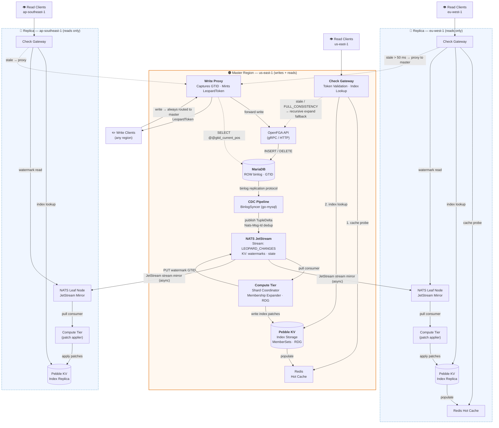
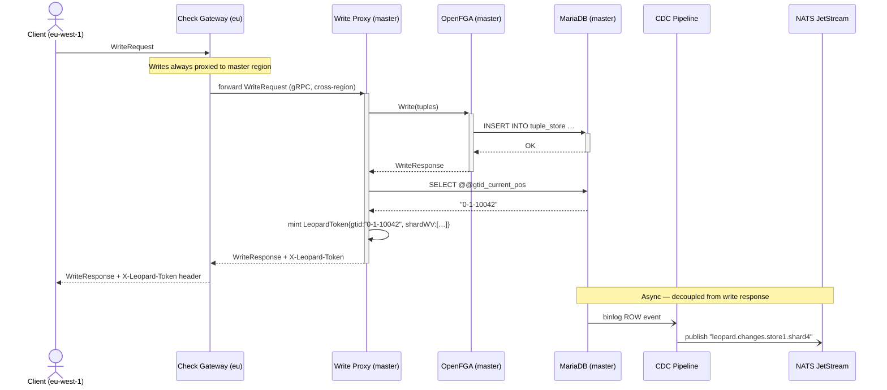
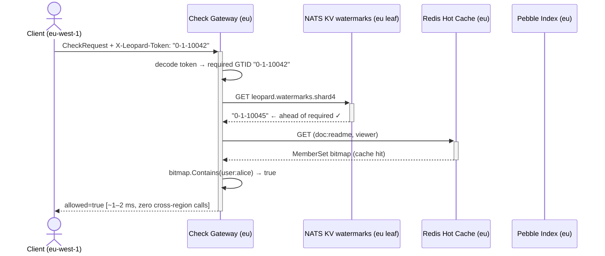
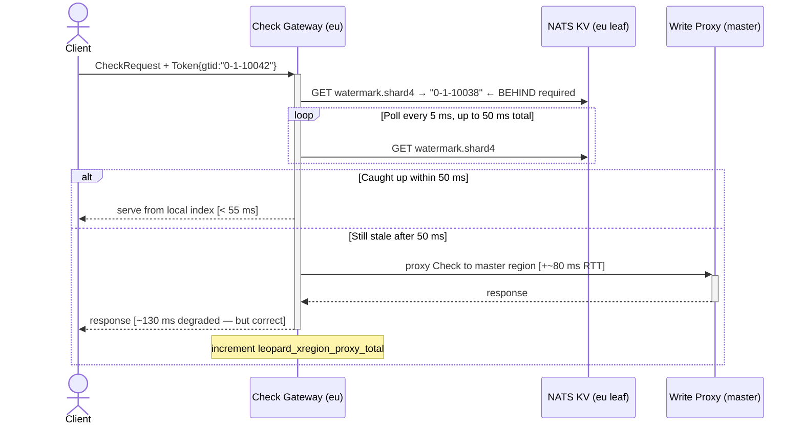
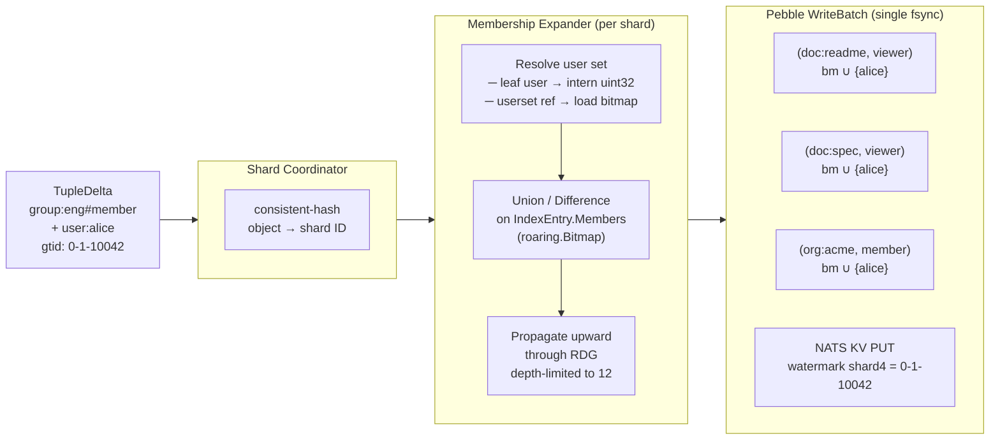
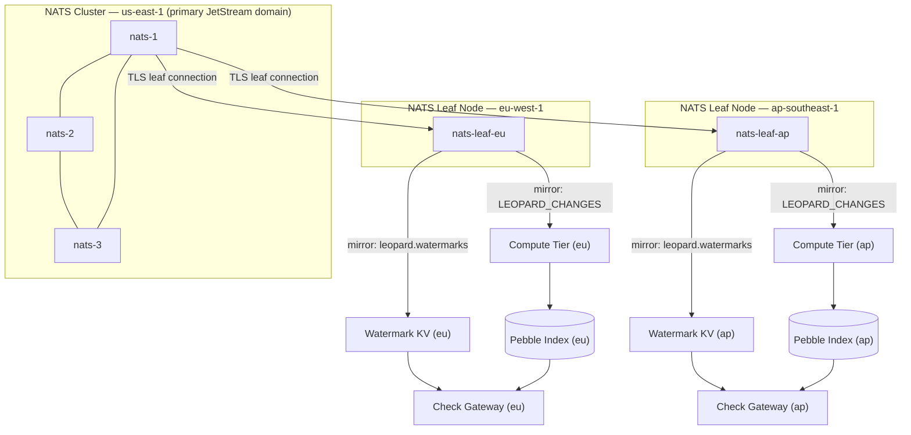
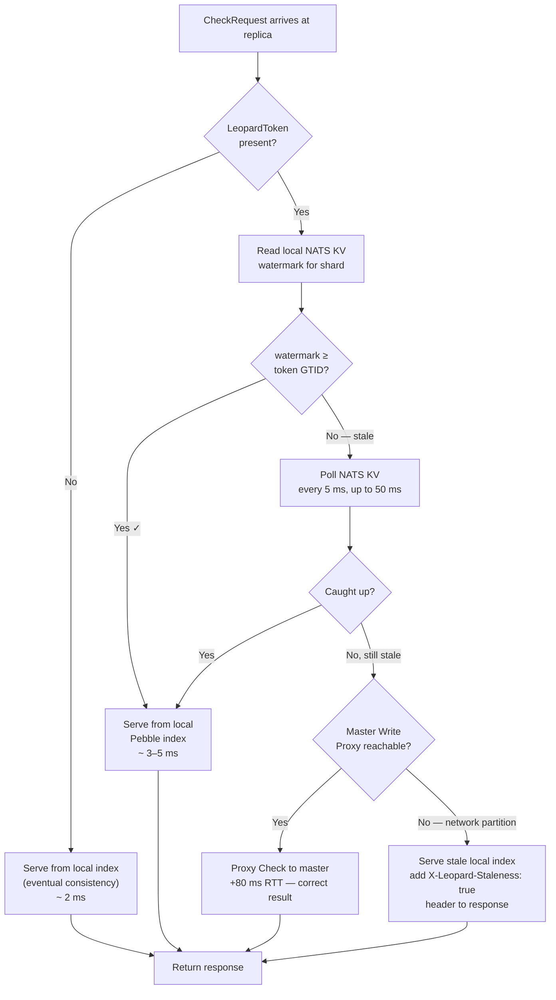
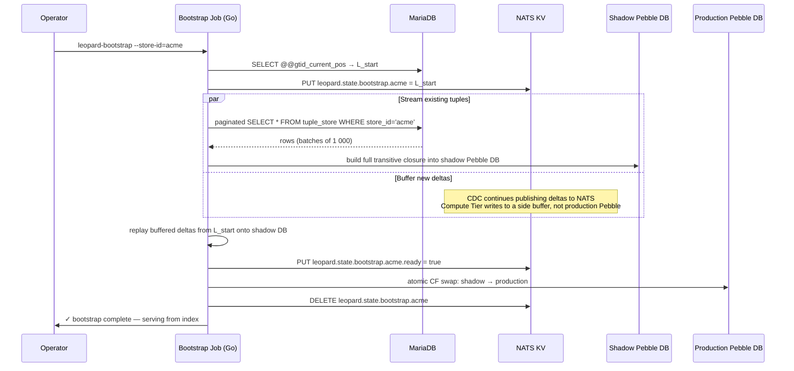

# Leopard Indexing System for OpenFGA

> **RFC-LPD-004** · Status: `FINAL` · Language: `Go` · v4.0.0

A precomputed, changelog-driven group-membership index that enables sub-millisecond
`Check` authorization across large-scale, multi-cluster OpenFGA deployments.  
Inspired by Google Zanzibar's *Leopard* index — adapted for OpenFGA, MariaDB, and NATS JetStream.

---

## Table of Contents

1. [Design Goals & Non-Goals](#1-design-goals--non-goals)
2. [Architecture Overview](#2-architecture-overview)
3. [Topology: Write-Only Master, Read-Only Replicas](#3-topology-write-only-master-read-only-replicas)
4. [Component Deep-Dives](#4-component-deep-dives)
   - 4.1 [Write Proxy](#41-write-proxy)
   - 4.2 [MariaDB Binlog CDC](#42-mariadb-binlog-cdc)
   - 4.3 [NATS JetStream Pipeline](#43-nats-jetstream-pipeline)
   - 4.4 [Compute Tier](#44-compute-tier)
   - 4.5 [Index Storage — Pebble KV](#45-index-storage--pebble-kv)
   - 4.6 [Check Gateway](#46-check-gateway)
5. [Consistency Token](#5-consistency-token)
6. [Data Model & Index Schema](#6-data-model--index-schema)
7. [Multi-Cluster Replication](#7-multi-cluster-replication)
8. [Failure Modes & Resilience](#8-failure-modes--resilience)
9. [Operations & Observability](#9-operations--observability)
10. [Performance Targets](#10-performance-targets)
11. [Repository Layout](#11-repository-layout)

---

## 1. Design Goals & Non-Goals

### Goals

| # | Goal |
|---|------|
| G1 | `Check` p99 latency **< 5 ms** for any user/object/relation triple, regardless of group nesting depth |
| G2 | Authorization reads served **fully locally** in every region — no cross-region RTT on the read path |
| G3 | **Read-your-own-writes** guarantee via a lightweight `LeopardToken` consistency mechanism |
| G4 | Index kept fresh within **< 500 ms** of a tuple write under normal conditions |
| G5 | **Zero changes to OpenFGA's API surface** — Leopard is a transparent sidecar layer |
| G6 | Graceful degradation to OpenFGA's native recursive expander at every failure boundary |

### Non-Goals

- Replacing OpenFGA's `Write` API or tuple storage — MariaDB remains the source of truth
- Indexing condition-gated tuples — runtime conditions cannot be precomputed
- Strong consistency for every `Check` by default — `FULL_CONSISTENCY` delegates to OpenFGA directly
- Replacing OpenFGA's model evaluation logic

---

## 2. Architecture Overview



---

## 3. Topology: Write-Only Master, Read-Only Replicas

### Why This Topology

Authorization systems are **read-dominated** — typical ratios are 100:1 to 1000:1 reads vs writes.
Making writes slightly slower (one extra cross-region RTT) to make reads fast everywhere is the correct trade.
This is the same model used by Google Zanzibar, Authzed SpiceDB, and every large-scale authz system.

```
Write latency added (replica region):  +60–120 ms cross-region RTT   ← acceptable
Read latency saved (all regions):      -50 to -100 ms per Check       ← the whole point
```

### Write Flow (any region → master)



### Read Flow (fully local to replica — no cross-region)



### Stale Read Handling



---

## 4. Component Deep-Dives

### 4.1 Write Proxy

The Write Proxy is a thin gRPC/HTTP pass-through in the master region.
Its only jobs: forward writes to OpenFGA, capture the resulting GTID, mint a `LeopardToken`.

```go
// internal/proxy/write_proxy.go

type WriteProxy struct {
    fga        openfgav1.OpenFGAServiceClient
    db         *sql.DB
    watermarks nats.KeyValue
    hlc        *HybridLogicalClock
}

func (p *WriteProxy) Write(
    ctx context.Context,
    req *openfgav1.WriteRequest,
) (*openfgav1.WriteResponse, error) {

    // 1. Forward to OpenFGA — MariaDB remains the source of truth
    resp, err := p.fga.Write(ctx, req)
    if err != nil {
        return nil, err
    }

    // 2. Capture the GTID of the just-committed transaction
    var gtid string
    if err := p.db.QueryRowContext(ctx,
        "SELECT @@gtid_current_pos").Scan(&gtid); err != nil {
        return nil, fmt.Errorf("capture gtid: %w", err)
    }

    // 3. Snapshot current shard watermark vector from NATS KV
    shardWV, err := p.currentShardWatermarks(ctx)
    if err != nil {
        return nil, err
    }

    // 4. Mint LeopardToken and attach to response metadata
    token := LeopardToken{
        GTID:    gtid,
        ShardWV: shardWV,
        HLC:     p.hlc.Now(),
        StoreID: req.GetStoreId(),
    }
    if resp.Metadata == nil {
        resp.Metadata = make(map[string]string)
    }
    resp.Metadata["leopard-token"] = token.Encode()

    return resp, nil
}
```

### 4.2 MariaDB Binlog CDC

#### Required MariaDB Configuration

```ini
# /etc/mysql/my.cnf
[mysqld]
binlog_format    = ROW          # mandatory — exact per-row before/after values
binlog_row_image = FULL         # include all columns in row images
gtid_strict_mode = ON           # deterministic GTID ordering
log_bin          = /var/log/mysql/mysql-bin.log
server_id        = 1
expire_logs_days = 7
```

```sql
-- Dedicated replication user for CDC
CREATE USER 'leopard_cdc'@'%' IDENTIFIED BY '<strong-password>';
GRANT REPLICATION SLAVE, REPLICATION CLIENT ON *.* TO 'leopard_cdc'@'%';
FLUSH PRIVILEGES;
```

#### BinlogSyncer (Go)

```go
// internal/cdc/binlog_source.go

import (
    "github.com/go-mysql-org/go-mysql/mysql"
    "github.com/go-mysql-org/go-mysql/replication"
)

type BinlogSource struct {
    syncer   *replication.BinlogSyncer
    streamer *replication.BinlogStreamer
    stateKV  nats.KeyValue // persists last committed GTID across restarts
}

func NewBinlogSource(cfg Config, stateKV nats.KeyValue) (*BinlogSource, error) {
    syncer := replication.NewBinlogSyncer(replication.BinlogSyncerConfig{
        ServerID: 99,          // unique across all replication clients
        Flavor:   "mariadb",   // critical: NOT "mysql" — enables MariaDB GTID
        Host:     cfg.Host,
        Port:     cfg.Port,
        User:     "leopard_cdc",
        Password: cfg.Password,
    })

    // Resume from last committed GTID (survives restarts gracefully)
    lastGTID, _ := loadLastGTID(stateKV)
    gtidSet, err := mysql.ParseMariadbGTIDSet(lastGTID)
    if err != nil {
        return nil, fmt.Errorf("parse gtid: %w", err)
    }

    streamer, err := syncer.StartSyncGTID(gtidSet)
    if err != nil {
        return nil, fmt.Errorf("start sync: %w", err)
    }
    return &BinlogSource{syncer, streamer, stateKV}, nil
}

func (b *BinlogSource) Stream(ctx context.Context, out chan<- TupleDelta) error {
    for {
        ev, err := b.streamer.GetEvent(ctx)
        if err != nil {
            return fmt.Errorf("get event: %w", err)
        }
        if e, ok := ev.Event.(*replication.RowsEvent); ok {
            if isTupleStoreTable(e.Table) {
                if d, ok := rowEventToTupleDelta(ev, e); ok {
                    select {
                    case out <- d:
                    case <-ctx.Done():
                        return ctx.Err()
                    }
                }
            }
        }
    }
}
```

#### Row Event → TupleDelta

```go
// internal/cdc/tuple_delta.go
//
// OpenFGA tuple_store columns (MariaDB):
//   store_id | object_type | object_id | relation | _user |
//   condition_name | ulid | inserted_at

type OpType uint8

const (
    Insert OpType = iota
    Delete
)

type TupleDelta struct {
    Op            OpType
    StoreID       string
    ObjectType    string
    ObjectID      string
    Relation      string
    User          string // "user:alice"  OR  "group:eng#member" (userset ref)
    ConditionName string // non-empty → skip indexing
    GTID          string // MariaDB GTID e.g. "0-1-10042"
    MsgID         string // NATS dedup key: sha256(storeID+GTID+ulid)
}

// IsIndexable returns false for condition-gated tuples.
// Runtime conditions cannot be precomputed into the index.
func (d TupleDelta) IsIndexable() bool { return d.ConditionName == "" }
func (d TupleDelta) ObjectRef() string { return d.ObjectType + ":" + d.ObjectID }
```

### 4.3 NATS JetStream Pipeline

#### Subject & KV Hierarchy

```
leopard.changes.{storeId}.{shardId}   ← TupleDelta events  (WorkQueue retention)
leopard.watermarks.{shardId}          ← KV: index watermark per shard (GTID string)
leopard.state.cdc                     ← KV: last committed binlog GTID (resumption)
leopard.dirty.{storeId}               ← KV: entries queued for async re-derive
```

#### Stream & Consumer Provisioning

```go
// internal/nats/provisioner.go

func Provision(js nats.JetStreamContext, numShards int) error {
    // Main change stream
    if _, err := js.AddStream(&nats.StreamConfig{
        Name:       "LEOPARD_CHANGES",
        Subjects:   []string{"leopard.changes.>"},
        Retention:  nats.WorkQueuePolicy,  // auto-delete acknowledged messages
        Storage:    nats.FileStorage,
        Replicas:   3,
        MaxAge:     24 * time.Hour,
        Duplicates: 60 * time.Second,      // built-in dedup window
    }); err != nil {
        return fmt.Errorf("add stream: %w", err)
    }

    // One durable pull consumer per compute shard
    for i := range numShards {
        if _, err := js.AddConsumer("LEOPARD_CHANGES", &nats.ConsumerConfig{
            Durable:       fmt.Sprintf("leopard-shard-%d", i),
            FilterSubject: fmt.Sprintf("leopard.changes.*.%d", i),
            AckPolicy:     nats.AckExplicitPolicy,
            MaxDeliver:    5,
            AckWait:       30 * time.Second,
            MaxAckPending: 500,             // back-pressure knob
        }); err != nil {
            return fmt.Errorf("add consumer shard %d: %w", i, err)
        }
    }

    // KV buckets
    for _, bucket := range []string{
        "leopard.watermarks",
        "leopard.state",
        "leopard.dirty",
    } {
        if _, err := js.CreateKeyValue(&nats.KeyValueConfig{
            Bucket: bucket, Replicas: 3,
        }); err != nil {
            return fmt.Errorf("create kv %s: %w", bucket, err)
        }
    }
    return nil
}
```

#### Publisher (CDC → NATS)

```go
// internal/nats/publisher.go

func (p *Publisher) Publish(ctx context.Context, d TupleDelta) error {
    subject := fmt.Sprintf("leopard.changes.%s.%d",
        d.StoreID, ShardOf(d.ObjectRef()))

    msg := &nats.Msg{
        Subject: subject,
        Data:    mustMarshalProto(toProto(d)),
        Header:  nats.Header{},
    }
    // Nats-Msg-Id drives JetStream's built-in deduplication.
    // If CDC restarts and re-reads a GTID, JetStream silently
    // discards the duplicate within the 60 s dedup window.
    msg.Header.Set(nats.MsgIdHdr, d.MsgID)

    if _, err := p.js.PublishMsg(msg, nats.Context(ctx)); err != nil {
        return fmt.Errorf("publish: %w", err)
    }

    // Persist GTID so CDC pipeline resumes correctly after restart
    return p.stateKV.Put("cdc.gtid", []byte(d.GTID))
}
```

#### Pull Consumer (Compute Tier)

```go
// internal/compute/consumer.go

func (c *ShardConsumer) Run(ctx context.Context) error {
    for {
        if ctx.Err() != nil {
            return ctx.Err()
        }

        msgs, err := c.sub.Fetch(64, nats.MaxWait(200*time.Millisecond))
        if errors.Is(err, nats.ErrTimeout) {
            continue // idle — re-poll
        }
        if err != nil {
            return fmt.Errorf("fetch shard %d: %w", c.shardID, err)
        }

        deltas := make([]TupleDelta, 0, len(msgs))
        for _, m := range msgs {
            d, err := fromProto(m.Data)
            if err != nil {
                m.Nak()
                continue
            }
            if d.IsIndexable() {
                deltas = append(deltas, d)
            }
        }

        if err := c.expander.ApplyBatch(ctx, deltas); err != nil {
            c.metrics.BatchErrors.Inc()
            for _, m := range msgs {
                m.Nak() // JetStream redelivers up to MaxDeliver times
            }
            continue
        }

        // Advance shard watermark atomically in NATS KV
        c.wm.Put(
            fmt.Sprintf("shard.%d", c.shardID),
            []byte(deltas[len(deltas)-1].GTID),
        )
        for _, m := range msgs {
            m.Ack()
        }
    }
}
```

#### NATS JetStream vs Kafka — Key Differences

| Concern | Kafka | NATS JetStream |
|---|---|---|
| Ordering guarantee | Per-partition key | Per-subject; `MaxInFlight=1` for strict order |
| Deduplication | Idempotent producer + transactions | Built-in: `Duplicates` window + `Nats-Msg-Id` header |
| Watermark store | External (ZK / Consul / DB) | **NATS KV bucket** — no extra service |
| Cross-region replication | MirrorMaker 2 (complex) | **Leaf Nodes + stream mirroring** — native, ~10 lines of config |
| Consumer model | Push (poll loop) | **Pull** — shard controls its own pace and back-pressure |
| Back-pressure | Consumer lag metric / manual | `MaxAckPending` on consumer config — JetStream auto-throttles |
| Operational complexity | ZooKeeper/KRaft + Kafka | Single `nats-server` binary |

### 4.4 Compute Tier



#### Membership Expander

```go
// internal/compute/expander.go

const maxPropDepth = 12 // circuit breaker — prevents cascade storms

type MembershipExpander struct {
    storage *IndexStorage
    rdg     *ReverseDepGraph
    dirty   nats.KeyValue // async re-derive queue for depth-exceeded entries
    metrics *Metrics
}

func (e *MembershipExpander) ApplyBatch(ctx context.Context, deltas []TupleDelta) error {
    batch := e.storage.NewBatch()
    defer batch.Close()

    for _, d := range deltas {
        key := LeopardKey{
            StoreID: d.StoreID, ObjectType: d.ObjectType,
            ObjectID: d.ObjectID, Relation: d.Relation,
        }
        if err := e.applyDelta(batch, key, d, 0); err != nil {
            return err
        }
    }

    return batch.Commit(&pebble.WriteOptions{Sync: true}) // one fsync for the batch
}

func (e *MembershipExpander) applyDelta(
    batch *pebble.Batch, key LeopardKey, d TupleDelta, depth int,
) error {

    // Circuit breaker: enqueue dirty entry for async re-derive
    if depth > maxPropDepth {
        e.metrics.CircuitBreakerFired.Inc()
        return e.dirty.Put(key.Encode(), []byte(d.GTID))
    }

    entry, err := e.storage.Load(key)
    if err != nil {
        return err
    }

    // Resolve which user IDs this delta adds or removes.
    // If d.User is a userset ref (e.g. "group:eng#member"),
    // look up that entry's current member bitmap.
    affectedIDs, err := e.resolveUsers(d)
    if err != nil {
        return err
    }

    switch d.Op {
    case Insert:
        entry.Members.Or(affectedIDs)
    case Delete:
        entry.Members.AndNot(affectedIDs)
    }
    entry.GTID = d.GTID
    entry.Generation++

    if err := batch.Set(key.Bytes(), entry.Marshal(), nil); err != nil {
        return err
    }

    // Walk reverse dependency graph upward
    deps, err := e.rdg.DependentsOf(key)
    if err != nil {
        return err
    }
    for _, dep := range deps {
        if err := e.applyDelta(batch, dep, d, depth+1); err != nil {
            return err
        }
    }
    return nil
}
```

### 4.5 Index Storage — Pebble KV

[`cockroachdb/pebble`](https://github.com/cockroachdb/pebble) is chosen over RocksDB JNI because it is:

- **Pure Go** — no CGO, no native library management, simpler Docker builds and cross-compilation
- **LSM architecture** — optimized for write-heavy workloads (index patch streams)
- **Snapshot reads** — consistent point-in-time views for concurrent index lookups
- **Production-battle-tested** — CockroachDB's embedded storage engine

```go
// internal/storage/pebble_storage.go

const (
    prefixIndex      = byte('I') // index entries
    prefixRDG        = byte('R') // reverse dependency graph entries
    prefixUserIntern = byte('U') // user string → uint32 interning
)

func Open(dir string) (*IndexStorage, error) {
    db, err := pebble.Open(dir, &pebble.Options{
        MemTableSize: 128 << 20, // 128 MB memtable
        Levels: []pebble.LevelOptions{
            {Compression: pebble.SnappyCompression},
        },
    })
    if err != nil {
        return nil, err
    }
    s := &IndexStorage{db: db, intern: make(map[string]uint32)}
    return s, s.loadInternTable()
}

func (s *IndexStorage) Load(key LeopardKey) (*IndexEntry, error) {
    val, closer, err := s.db.Get(key.Bytes())
    if errors.Is(err, pebble.ErrNotFound) {
        return &IndexEntry{Members: roaring.New()}, nil
    }
    if err != nil {
        return nil, err
    }
    defer closer.Close()
    return unmarshalEntry(val)
}

// InternUser maps a string user ID to a compact uint32 for bitmap storage.
// The intern table is persisted in Pebble so it survives restarts.
func (s *IndexStorage) InternUser(storeID, user string) (uint32, error) {
    s.mu.Lock()
    defer s.mu.Unlock()

    k := storeID + "\x00" + user
    if id, ok := s.intern[k]; ok {
        return id, nil
    }
    id := s.nextID
    s.nextID++
    s.intern[k] = id

    iKey := append([]byte{prefixUserIntern}, []byte(k)...)
    return id, s.db.Set(iKey, uint32ToBytes(id), pebble.Sync)
}
```

#### MemberSet Representation

```go
// internal/storage/member_set.go
//
// Roaring bitmaps compress a 1-million-member group to ~125 KB.
// Uses github.com/RoaringBitmap/roaring — pure Go, no CGO.

import "github.com/RoaringBitmap/roaring"

const wildcardSentinel = uint32(0xFFFFFFFF) // reserved ID for user:*

type MemberSet struct{ bm *roaring.Bitmap }

func (m *MemberSet) Add(id uint32)                { m.bm.Add(id) }
func (m *MemberSet) Remove(id uint32)             { m.bm.Remove(id) }
func (m *MemberSet) Contains(id uint32) bool      { return m.bm.Contains(id) }
func (m *MemberSet) Or(o *roaring.Bitmap)         { m.bm.Or(o) }
func (m *MemberSet) AndNot(o *roaring.Bitmap)     { m.bm.AndNot(o) }
func (m *MemberSet) ContainsWildcard() bool       { return m.bm.Contains(wildcardSentinel) }
```

### 4.6 Check Gateway

```go
// internal/gateway/check_gateway.go

type CheckGateway struct {
    localIndex *IndexStorage
    cache      *RedisCache
    watermarks nats.KeyValue
    masterGW   openfgav1.OpenFGAServiceClient // cross-region fallback
    localFGA   openfgav1.OpenFGAServiceClient // recursive expand fallback
    metrics    *Metrics
}

func (g *CheckGateway) Check(
    ctx context.Context,
    req *openfgav1.CheckRequest,
) (*openfgav1.CheckResponse, error) {

    // FULL_CONSISTENCY → bypass index, use OpenFGA recursive expand
    if req.GetConsistency() == openfgav1.ConsistencyPreference_FULL_CONSISTENCY {
        return g.localFGA.Check(ctx, req)
    }

    token, _ := extractToken(ctx) // from X-Leopard-Token header

    if token != nil {
        shardID := ShardOf(req.GetObject(), req.GetRelation())
        stale, err := g.isStale(ctx, token, shardID)
        if err != nil {
            return nil, err
        }
        if stale {
            return g.handleStale(ctx, req, token, shardID)
        }
    }

    return g.indexCheck(ctx, req)
}

func (g *CheckGateway) indexCheck(
    ctx context.Context, req *openfgav1.CheckRequest,
) (*openfgav1.CheckResponse, error) {
    key := keyFromReq(req)

    // 1. Hot cache probe (Redis) — O(1)
    if members, ok := g.cache.Get(ctx, key); ok {
        g.metrics.CacheHits.Inc()
        return membershipResp(members, req.GetUser()), nil
    }

    // 2. Index storage lookup (Pebble) — O(log n)
    entry, err := g.localIndex.Load(key)
    if err != nil {
        g.metrics.IndexFallback.WithLabelValues("storage_error").Inc()
        return g.localFGA.Check(ctx, req) // graceful degradation
    }

    g.cache.Set(ctx, key, entry.Members, 5*time.Minute)
    return membershipResp(entry.Members, req.GetUser()), nil
}

func (g *CheckGateway) handleStale(
    ctx context.Context, req *openfgav1.CheckRequest,
    token *LeopardToken, shardID int,
) (*openfgav1.CheckResponse, error) {
    deadline := time.Now().Add(50 * time.Millisecond)
    for time.Now().Before(deadline) {
        time.Sleep(5 * time.Millisecond)
        if stale, _ := g.isStale(ctx, token, shardID); !stale {
            return g.indexCheck(ctx, req)
        }
    }
    // Proxy to master region as last resort
    g.metrics.XRegionProxy.Inc()
    return g.masterGW.Check(ctx, req)
}
```

---

## 5. Consistency Token

> [!IMPORTANT]
> OpenFGA has **no Zookie**. Zookies are specific to Authzed/SpiceDB.
> The `LeopardToken` is a **Leopard-layer addition only** — it does not modify OpenFGA's API.
> Clients that omit `X-Leopard-Token` receive eventual consistency, which is correct for most use cases.

### Token Structure

```go
// internal/token/leopard_token.go

// LeopardToken is a lightweight consistency handle returned from every write.
// Clients optionally pass it on subsequent Check calls via X-Leopard-Token
// to guarantee read-your-own-writes semantics within the Leopard index.
type LeopardToken struct {
    GTID    string   // MariaDB GTID e.g. "0-1-10042"
    ShardWV []uint64 // per-shard watermark vector at write time
    HLC     uint64   // Hybrid Logical Clock — cross-region ordering
    StoreID string   // scoped to one OpenFGA store
}

// Encode: proto-marshal → base64url (safe for HTTP headers)
func (t LeopardToken) Encode() string {
    b, _ := proto.Marshal(tokenToProto(t))
    return base64.RawURLEncoding.EncodeToString(b)
}

func Decode(s string) (LeopardToken, error) {
    b, err := base64.RawURLEncoding.DecodeString(s)
    if err != nil {
        return LeopardToken{}, err
    }
    var pb leopardv1.Token
    if err := proto.Unmarshal(b, &pb); err != nil {
        return LeopardToken{}, err
    }
    return tokenFromProto(&pb), nil
}
```

### GTID Comparison

```go
// internal/token/gtid.go
//
// MariaDB GTID format: "domain_id-server_id-sequence_num"
// For single-primary: compare sequence numbers.
// For multi-source: use GTIDSet subset semantics via go-mysql.

func gtidGeq(current, required string) bool {
    if required == "" {
        return true
    }
    currSet, err1 := mysql.ParseMariadbGTIDSet(current)
    reqSet, err2  := mysql.ParseMariadbGTIDSet(required)
    if err1 != nil || err2 != nil {
        return false // safe default: treat as stale
    }
    // required is a subset of current → current has seen everything in required
    return reqSet.Contain(currSet)
}
```

### Consistency Mode Matrix

| OpenFGA Consistency | Token Present | Leopard Behavior | p99 Target |
|---|---|---|---|
| `MINIMIZE_LATENCY` | No | Serve from local index as-is (eventual) | **< 2 ms** |
| `MINIMIZE_LATENCY` | Yes | Validate GTID; poll ≤ 50 ms; proxy master if stale | **< 5 ms** |
| `HIGHER_CONSISTENCY` | No | Read global high-watermark from NATS KV; serve that snapshot | **< 6 ms** |
| `HIGHER_CONSISTENCY` | Yes | Full GTID validation + watermark check before serving | **< 8 ms** |
| `FULL_CONSISTENCY` | Either | Bypass Leopard — delegate to OpenFGA recursive expand | 20–80 ms |

---

## 6. Data Model & Index Schema

### Key Encoding

```
'I' | store_id | NUL | obj_type | ':' | obj_id | '#' | relation  →  IndexEntry
'R' | store_id | NUL | obj_type | ':' | obj_id | '#' | relation  →  RDGEntry
'U' | store_id | NUL | user_string                               →  uint32 (intern ID)
```

### Protobuf Definitions

```protobuf
// proto/leopard/v1/index.proto

message IndexEntry {
    bytes  members    = 1;  // serialized roaring.Bitmap
    string model_id   = 2;  // auth model version that produced this entry
    string gtid       = 3;  // GTID watermark of last applied delta
    uint64 generation = 4;  // optimistic concurrency counter
}

message RDGEntry {
    // Upstream entries that depend on this (object, relation).
    // Example: (group:eng, member) → [(org:acme, member), (doc:readme, viewer)]
    repeated LeopardKey dependents = 1;
}

message LeopardKey {
    string store_id    = 1;
    string object_type = 2;
    string object_id   = 3;
    string relation    = 4;
}
```

### Indexability Rules

| Relation Type | Indexed | Rationale |
|---|---|---|
| Direct user tuple | ✅ Always | Leaf — the base of all member sets |
| Computed userset (`viewer from editor`) | ✅ Derived | Transitively expanded through RDG |
| Tuple-to-userset (`member of parent`) | ✅ Derived | Cross-type expansion tracked in RDG |
| Wildcard (`user:*`) | ⚡ Sentinel | Stored as reserved `uint32(0xFFFFFFFF)` |
| Condition-gated tuple | ❌ Skipped | Runtime conditions cannot be precomputed |

---

## 7. Multi-Cluster Replication

### NATS Leaf Node Topology



### Leaf Node Config

```hcl
# deploy/nats/leaf-eu.conf

leafnodes {
  remotes = [{
    urls:        ["nats-leaf://nats-cluster.us-east-1.internal:7422"]
    credentials: "/etc/nats/leaf-eu.creds"
    tls { ca_file: "/etc/nats/ca.pem" }
  }]
}

jetstream {
  store_dir: "/data/nats"
  domain:    "eu-west-1"   # unique JetStream domain per region
  max_mem:   "4GB"
  max_file:  "500GB"
}
```

### Mirror Provisioning (Go)

```go
// internal/replica/mirror_setup.go

func SetupMirrors(js nats.JetStreamContext, primaryDomain string) error {
    // Mirror the change stream
    if _, err := js.AddStream(&nats.StreamConfig{
        Name:   "LEOPARD_CHANGES_MIRROR",
        Mirror: &nats.StreamSource{Name: "LEOPARD_CHANGES", Domain: primaryDomain},
        Storage: nats.FileStorage,
        Replicas: 3,
    }); err != nil {
        return fmt.Errorf("mirror stream: %w", err)
    }

    // Mirror the watermarks KV so token validation is fully local
    _, err := js.CreateKeyValue(&nats.KeyValueConfig{
        Bucket: "leopard.watermarks",
        Mirror: &nats.StreamSource{
            Name: "KV_leopard.watermarks", Domain: primaryDomain,
        },
    })
    return err
}
```

### Cross-Region Failover Decision Tree



---

## 8. Failure Modes & Resilience

| Condition | Detection | Automatic Mitigation |
|---|---|---|
| Replica lag > 500 ms | `leopard_replica_lag_seconds` alert | Route `HIGHER_CONSISTENCY` checks to master proxy |
| Master Write Proxy unreachable | gRPC health probe timeout | Writes blocked globally; replica reads continue (eventual) |
| NATS leaf node partition | JetStream mirror lag spike | Replicas serve cached index; token checks proxy to master |
| Pebble shard I/O error | Storage error rate spike | Circuit breaker opens; gateway falls back to OpenFGA recursive expand |
| Auth model change | `model_id` mismatch on index entry read | Async re-index job triggered; OpenFGA recursive expand served during rebuild |
| RDG cascade storm | `leopard_rdg_depth_max > 10` | Circuit breaker fires at depth 12; dirty queue handles remainder asynchronously |
| CDC pipeline restart | GTID loaded from `leopard.state` NATS KV | BinlogSyncer resumes from last committed GTID; NATS dedup prevents duplicates |
| Redis hot cache failure | Connection error | Gateway falls through directly to Pebble — no correctness impact |

---

## 9. Operations & Observability

### Go Runtime Tuning

```bash
# Apply to all Leopard service deployments
GOGC=400          # allow 4× heap growth before GC — reduces GC frequency
GOMEMLIMIT=6GiB   # hard memory cap (Go 1.19+) — prevents OOM
GOMAXPROCS=8      # match container CPU limit
```

### Key Prometheus Metrics

```go
// internal/metrics/metrics.go  (abbreviated)

var (
    BinlogLagSeconds    = newGauge("leopard_binlog_lag_seconds")
    NATSConsumerPending = newGaugeVec("leopard_nats_consumer_pending", "shard")

    CheckLatency = prometheus.NewHistogramVec(
        prometheus.HistogramOpts{
            Name:    "leopard_check_latency_seconds",
            Buckets: []float64{.001, .002, .005, .01, .025, .05, .1},
        }, []string{"consistency", "result"},
    )
    IndexFallbackTotal = newCounterVec("leopard_index_fallback_total", "reason")
    StaleFallbackTotal = newCounter("leopard_stale_fallback_total")
    XRegionProxyTotal  = newCounter("leopard_xregion_proxy_total")
    CacheHitRatio      = newGauge("leopard_cache_hit_ratio")

    RDGDepthMax      = newGauge("leopard_rdg_depth_max")
    BatchWriteMs     = newHistogram("leopard_batch_write_ms")
    DirtyQueueSize   = newGauge("leopard_dirty_queue_size")
    ReplicaLagSec    = newGaugeVec("leopard_replica_lag_seconds", "region")
    MemberSetSizeP99 = newGauge("leopard_member_set_size_p99")
)
```

### Alert Thresholds

| Metric | Warn | Page |
|---|---|---|
| `leopard_binlog_lag_seconds` | > 0.5 s | > 2 s |
| `leopard_nats_consumer_pending` | > 5 000 | > 20 000 |
| `leopard_index_fallback_total` rate | > 5 % | > 15 % |
| `leopard_xregion_proxy_total` rate | > 2 % | > 10 % |
| `leopard_cache_hit_ratio` | < 85 % | < 70 % |
| `leopard_rdg_depth_max` | > 8 | > 12 |
| `leopard_replica_lag_seconds` | > 1 s | > 5 s |
| `leopard_check_latency_seconds` p99 | > 8 ms | > 20 ms |
| `leopard_dirty_queue_size` (growing) | > 1 000 | > 10 000 |

### Bootstrap & Full Re-Index

Required when first deploying Leopard or when the OpenFGA authorization model changes.



---

## 10. Performance Targets

| Scenario | Without Leopard | With Leopard | Gain |
|---|---|---|---|
| User in 8-level nested group, `Check` | ~80 ms (8 DB round-trips) | ~3 ms (1 Pebble lookup) | **27× faster** |
| Hot `org#member` Check at 10 K RPS | 100 % DB load on every call | Redis cache hit — zero DB | **~100 % DB offload** |
| `BatchCheck` 500 objects, same user | 500 sequential expanders | N shard parallel reads | **40–80× faster** |
| `Check` from replica region (no token) | ~100 ms (proxy to master) | ~2 ms (local index) | **50× faster** |
| `ListObjects` for user with 50 K grants | Full tuple table scan | Inverse index range scan | **O(log n) vs O(n)** |
| Write from replica region | — | +60–120 ms cross-region RTT | Expected cost of write-only master |

### Estimated Storage

| Dataset | Calculation | Estimated Size |
|---|---|---|
| 10 M tuples · 5 relations each | 50 M entries × ~200 B | ~10 GB |
| Group with 1 M members · 10 K objects | 10 K entries × ~125 KB bitmap | ~1.25 GB |
| Reverse Dependency Graph | 10 M tuples × avg fanout 10 × 64 B | ~6.4 GB |
| Redis hot cache (top 1 % objects) | 50 K entries × ~50 KB | ~2.5 GB |

---

## 11. Repository Layout

```
leopard/
│
├── cmd/
│   ├── leopard-cdc/          # Binary: MariaDB binlog → NATS
│   ├── leopard-compute/      # Binary: NATS pull consumer → Pebble
│   ├── leopard-gateway/      # Binary: Check Gateway (gRPC / HTTP)
│   └── leopard-bootstrap/    # CLI: full re-index tool
│
├── internal/
│   ├── cdc/
│   │   ├── binlog_source.go  # BinlogSyncer (go-mysql)
│   │   └── tuple_delta.go    # RowsEvent → TupleDelta
│   ├── nats/
│   │   ├── provisioner.go    # Stream + consumer + KV setup
│   │   └── publisher.go      # TupleDelta → NATS publish w/ dedup
│   ├── compute/
│   │   ├── consumer.go       # Pull consumer loop (per shard)
│   │   ├── coordinator.go    # Consistent-hash shard routing
│   │   └── expander.go       # Membership Expander + RDG traversal
│   ├── storage/
│   │   ├── pebble.go         # IndexStorage (Pebble-backed)
│   │   ├── member_set.go     # Roaring bitmap wrapper
│   │   └── rdg.go            # Reverse Dependency Graph
│   ├── gateway/
│   │   ├── check_gateway.go  # Check API: cache → index → fallback
│   │   └── write_proxy.go    # Write passthrough + token minting
│   ├── token/
│   │   ├── leopard_token.go  # Encode / decode LeopardToken
│   │   └── gtid.go           # MariaDB GTID comparison helpers
│   ├── replica/
│   │   ├── mirror_setup.go   # NATS JetStream mirror provisioning
│   │   └── lag_tracker.go    # Replication health + alerting
│   └── metrics/
│       └── metrics.go        # Prometheus metric definitions
│
├── proto/
│   └── leopard/v1/
│       ├── index.proto        # IndexEntry · RDGEntry · LeopardKey
│       ├── token.proto        # LeopardToken
│       └── delta.proto        # TupleDelta
│
├── deploy/
│   ├── docker-compose.yml     # Local dev: MariaDB + NATS + all services
│   ├── k8s/
│   │   ├── master/            # Write Proxy · CDC · Compute · Gateway
│   │   └── replica/           # Compute · Gateway · NATS Leaf
│   └── nats/
│       ├── master.conf
│       └── leaf-template.conf
│
├── go.mod
├── go.sum
├── Makefile
└── README.md
```

### Go Module Dependencies

| Purpose | Module |
|---|---|
| MariaDB binlog CDC | `github.com/go-mysql-org/go-mysql` |
| NATS JetStream | `github.com/nats-io/nats.go` |
| Embedded KV (index) | `github.com/cockroachdb/pebble` |
| Roaring bitmaps | `github.com/RoaringBitmap/roaring` |
| Consistent hashing | `github.com/tysonmote/rendezvous` |
| gRPC | `google.golang.org/grpc` |
| Protobuf | `google.golang.org/protobuf` |
| Prometheus | `github.com/prometheus/client_golang` |
| Structured logging | `go.uber.org/zap` |
| Integration tests | `github.com/testcontainers/testcontainers-go` |

---

*RFC-LPD-004 · Leopard Indexing System for OpenFGA · Go · MariaDB Binlog CDC · NATS JetStream · Write-Only Master / Read-Only Replicas*
