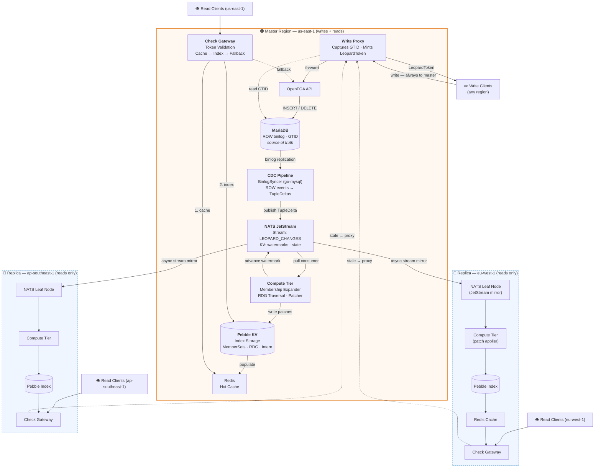
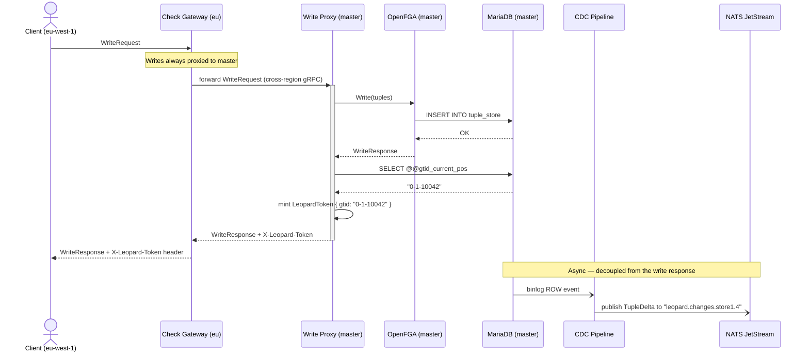
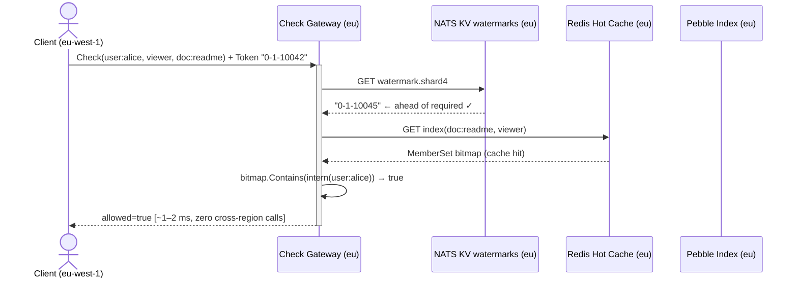
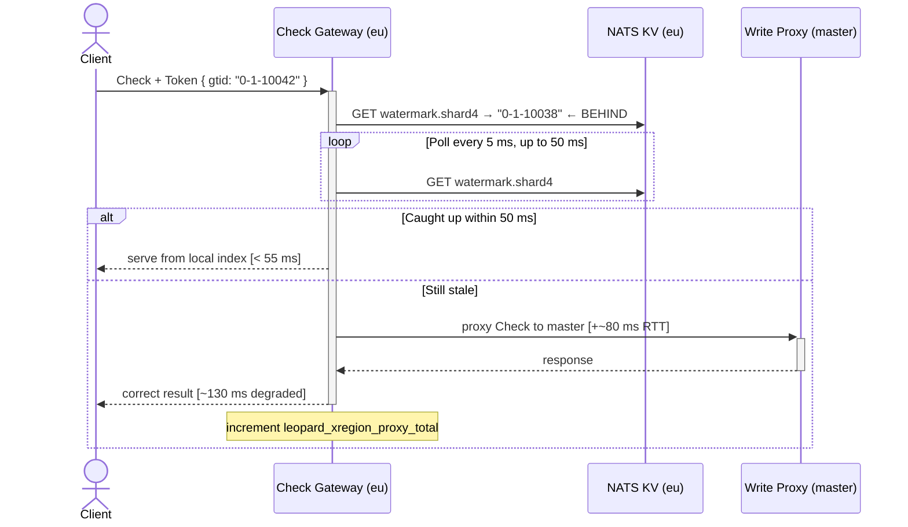
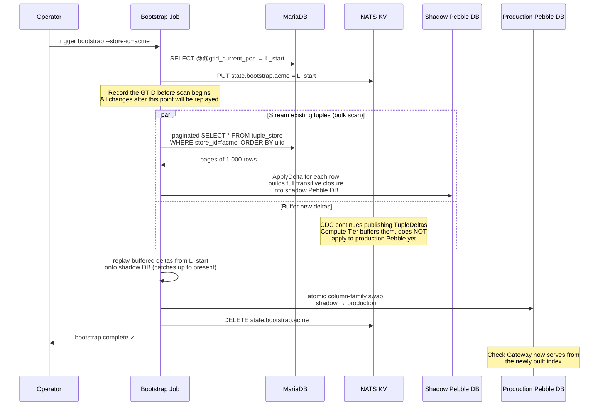
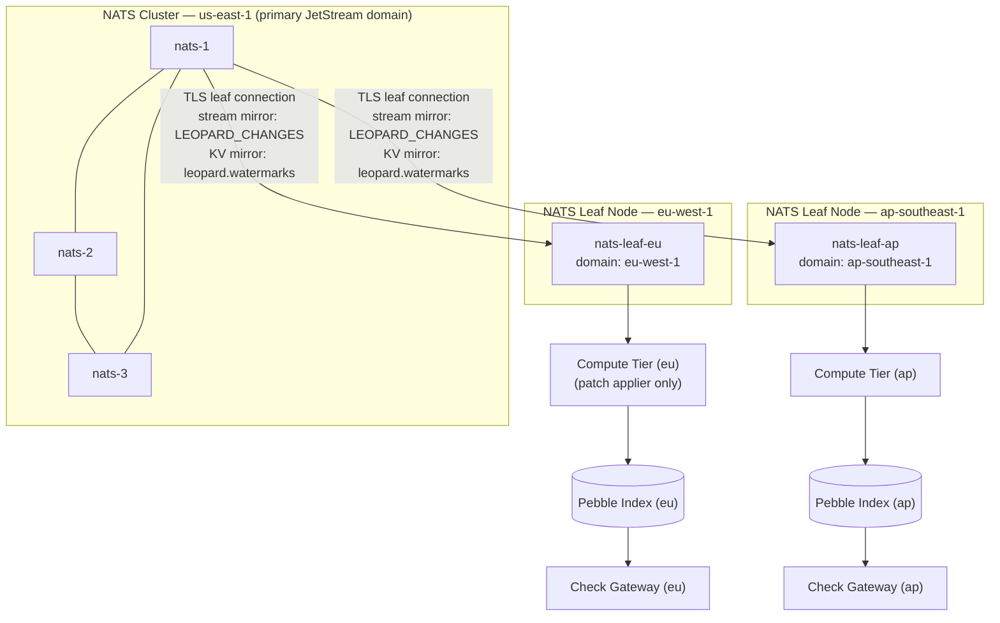
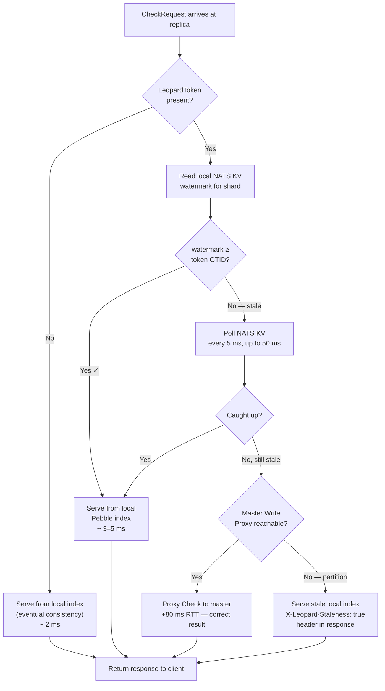

# Leopard Indexing System for OpenFGA

> **RFC-LPD-004** · Status: `FINAL` · Language: `Go` · v4.0.0

A precomputed, changelog-driven group-membership index that enables sub-millisecond
`Check` authorization across large-scale, multi-cluster OpenFGA deployments.
Inspired by Google Zanzibar's *Leopard* index — adapted for OpenFGA, MariaDB, and NATS JetStream.

---

## Table of Contents

1. [The Core Problem](#1-the-core-problem)
2. [Design Goals](#2-design-goals)
3. [Architecture Overview](#3-architecture-overview)
4. [Topology: Write-Only Master, Read-Only Replicas](#4-topology-write-only-master-read-only-replicas)
5. [Index Design](#5-index-design)
   - 5.1 [What Is Precomputed](#51-what-is-precomputed)
   - 5.2 [Key Encoding](#52-key-encoding)
   - 5.3 [Value Encoding — Roaring Bitmap Member Sets](#53-value-encoding--roaring-bitmap-member-sets)
   - 5.4 [The Reverse Dependency Graph (RDG)](#54-the-reverse-dependency-graph-rdg)
   - 5.5 [Sharding Strategy](#55-sharding-strategy)
6. [Algorithms](#6-algorithms)
   - 6.1 [Check — Read Path](#61-check--read-path)
   - 6.2 [Apply Delta — Write Path](#62-apply-delta--write-path)
   - 6.3 [RDG Propagation](#63-rdg-propagation)
   - 6.4 [Bootstrap — Full Re-Index](#64-bootstrap--full-re-index)
7. [Change Data Capture Pipeline](#7-change-data-capture-pipeline)
8. [Consistency Model](#8-consistency-model)
9. [Multi-Cluster Replication](#9-multi-cluster-replication)
10. [Failure Modes & Resilience](#10-failure-modes--resilience)
11. [Operations & Observability](#11-operations--observability)
12. [Performance Targets](#12-performance-targets)
13. [Repository Layout & Dependencies](#13-repository-layout--dependencies)

---

## 1. The Core Problem

OpenFGA resolves `Check(user, relation, object)` by **recursively expanding** the
authorization model at query time. For a tuple like:

```
document:readme#viewer@group:eng#member
group:eng#member@group:backend#member
group:backend#member@user:alice
```

Answering *"can alice view readme?"* requires traversing every level of the chain —
three separate database round-trips in this example. For organizations with 8-level
nested groups and millions of users, this compounds into **50–100 ms p99 latency**
and significant database load.

The naive expansion also **repeats the same sub-graph traversals** across requests.
Every time any user inside `group:eng` checks a document they can view, OpenFGA
re-expands the entire group hierarchy from scratch.

**Leopard solves this by precomputing the answer.** For every `(object, relation)` pair
in the system, Leopard maintains the complete set of leaf users who hold that relation —
updated incrementally as tuples change. A `Check` becomes a **single bitmap lookup**
instead of a recursive database traversal.

---

## 2. Design Goals

| # | Goal |
|---|------|
| G1 | `Check` p99 latency **< 5 ms** regardless of group nesting depth |
| G2 | Reads served **fully locally** in every region — no cross-region RTT on the read path |
| G3 | **Read-your-own-writes** guarantee via a lightweight `LeopardToken` |
| G4 | Index kept fresh within **< 500 ms** of a tuple write under normal conditions |
| G5 | **Zero changes to OpenFGA's API surface** — Leopard is a transparent sidecar layer |
| G6 | Graceful degradation to OpenFGA's native recursive expander at every failure boundary |

---

## 3. Architecture Overview



The system has five distinct processing stages:

1. **Write Proxy** — transparently forwards writes to OpenFGA, then captures the resulting MariaDB GTID and mints a `LeopardToken` to return to the caller.
2. **CDC Pipeline** — acts as a MariaDB replication slave, consuming ROW-format binlog events and translating each row change into a `TupleDelta` message published to NATS JetStream.
3. **Compute Tier** — pull consumers on NATS JetStream, one per index shard. Each applies `TupleDelta` messages by computing the differential patch to the affected index entries and propagating changes upward through the Reverse Dependency Graph.
4. **Index Storage (Pebble)** — an embedded LSM key-value store holding the precomputed member sets, the RDG, and a user interning table. Sharded across nodes using consistent hashing.
5. **Check Gateway** — the read path. Validates the caller's `LeopardToken` against the NATS KV watermark, probes Redis for a cached result, falls through to Pebble for an index lookup, and degrades to OpenFGA's native recursive expand only as a last resort.

---

## 4. Topology: Write-Only Master, Read-Only Replicas

### Why Active-Passive

Authorization systems are **read-dominated** — typical read-to-write ratios are 100:1 to 1000:1. Making writes slightly slower (one extra cross-region RTT) to make reads fast everywhere is the correct trade. This is the same model used by Google Zanzibar, Authzed SpiceDB, and every large-scale authorization system in production.

```
Write latency added (replica region):  +60–120 ms cross-region RTT   ← acceptable
Read latency saved (all regions):      −50 to −100 ms per Check       ← the whole point
```

All replica regions route their **writes** to the master's Write Proxy transparently. Clients do not need to know or care which region they are in — the gateway handles the forwarding. Reads are always served locally from the replica's own Pebble index.

### Write Flow (any region → master)



### Read Flow (fully local — no cross-region)



### Stale Read Handling



---

## 5. Index Design

### 5.1 What Is Precomputed

The Leopard index stores the **transitive closure** of every authorization relationship in the system. For every `(object, relation)` pair that appears in OpenFGA — whether through a direct tuple, a computed userset, or a tuple-to-userset rewrite — the index precomputes the complete flat set of **leaf users** who hold that relation on that object.

```
Index entry:  (doc:readme, viewer)  →  { user:alice, user:bob, user:carol, … }
Index entry:  (org:acme,   member)  →  { user:alice, user:dan, user:eve, … }
Index entry:  (team:eng,   lead)    →  { user:alice }
```

This transforms a recursive graph traversal into a single **set membership test**: `alice ∈ members(doc:readme, viewer)`.

**What is not precomputed:**

- **Condition-gated tuples** — tuples with `condition_name` set cannot be precomputed because conditions are evaluated at runtime against a request context.
- **Wildcard relations** (`user:*`) — stored as a special sentinel value, recognized immediately during lookup without storing every user.

### 5.2 Key Encoding

Every index entry is addressed by a deterministically encoded binary key. The key encodes the full `(store_id, object_type, object_id, relation)` tuple in a way that is:

- **Lexicographically sortable** — so Pebble can range-scan all relations of a given object.
- **Prefix-grouped by object** — all relations of `doc:readme` are adjacent in the keyspace, enabling efficient multi-relation batch lookups.
- **Prefix-distinguished by entry type** — a single-byte prefix separates index entries, RDG entries, and the user intern table.

The three key namespaces are:

```
Prefix 'I'  →  Index entries (precomputed member sets)
Prefix 'R'  →  Reverse Dependency Graph entries
Prefix 'U'  →  User interning table (string → uint32)
```

Within each namespace, the remainder of the key is structured as:

```
store_id  NUL  object_type  ':'  object_id  '#'  relation
```

where `NUL` (`\x00`) is a null byte used as a field separator. The separators `:` and `#` are chosen to mirror OpenFGA's own tuple notation, making keys human-readable in debug tooling.

**Concrete examples:**

```
Key for index entry  (store:acme, doc:readme, viewer):
  'I' | "acme" | 0x00 | "document:readme#viewer"

Key for RDG entry of the same object:
  'R' | "acme" | 0x00 | "document:readme#viewer"

Key for user interning (store:acme, user:alice):
  'U' | "acme" | 0x00 | "user:alice"
```

This layout means the **prefix `I | store_id | NUL | object_type:object_id#`** can be used as a range-scan prefix to retrieve all index entries for a given object in one Pebble iterator pass — which is how `ListObjects` is accelerated.

### 5.3 Value Encoding — Roaring Bitmap Member Sets

Each index entry's value encodes the member set using a **Roaring Bitmap** — a compressed bitset representation optimised for sets of 32-bit integers.

**Why bitmaps, not sorted arrays or hash sets?**

| Structure | Storage (1 M members) | Contains | Union | Difference |
|---|---|---|---|---|
| `[]string` (raw user IDs) | ~30 MB | O(log n) binary search | O(n) merge | O(n) |
| `map[string]bool` | ~50 MB | O(1) | O(n) | O(n) |
| Roaring Bitmap (interned uint32) | **~125 KB** | **O(1)** | **O(n/64) SIMD** | **O(n/64) SIMD** |

The key enabler is **user interning**: every user string is mapped to a compact `uint32` ID stored in the `'U'`-prefixed keyspace in Pebble. The bitmap then operates on these integer IDs, not on strings. This reduces memory by ~240× for large member sets and enables SIMD-accelerated set operations during RDG propagation.

**Bitmap serialization format:**

Roaring Bitmaps self-describe their internal representation. The library (`github.com/RoaringBitmap/roaring`) uses one of three internal containers per 2^16 chunk of the ID space:

- **Array container** — for sparse chunks (< 4096 values): sorted `uint16` array, 2 bytes/value.
- **Bitmap container** — for dense chunks (≥ 4096 values): fixed 8 KB bitset, ~0.001 bytes/value.
- **Run-length encoded container** — for highly clustered values: pairs of `(start, length)`.

This means a group with 1 million sequentially-assigned user IDs occupies ~125 KB; a group with 1 million randomly-distributed IDs across a large ID space occupies more, but still significantly less than string storage.

**The serialized bitmap is stored directly as the `members` field in the Protobuf `IndexEntry` value.** No additional encoding is applied — Roaring's own wire format is compact and versioned.

### 5.4 The Reverse Dependency Graph (RDG)

The RDG answers the question: *"if `(A, r1)` changes its member set, which other index entries must also be updated?"*

It is a directed graph where an edge `(A, r1) → (B, r2)` means: *"the member set of `(B, r2)` includes the member set of `(A, r1)` as a sub-component."*

**Example:** Given the OpenFGA model:

```
type document
  relations
    define viewer: [user] or member from org
type org
  relations
    define member: [group#member]
type group
  relations
    define member: [user]
```

The RDG edges are:

```
(group:eng,  member) → (org:acme, member)
(org:acme,   member) → (document:readme, viewer)
(org:acme,   member) → (document:spec,   viewer)
(org:acme,   member) → (document:design, viewer)
  ... (all documents owned by org:acme)
```

When `user:alice` is added to `group:eng#member`, the propagation algorithm walks these edges upward, unioning `{alice}` into every transitively dependent entry in a single atomic Pebble batch.

**RDG construction:** The RDG is built and maintained by the Compute Tier. When a new tuple of the form `(object, relation, group:X#member)` is inserted, the Compute Tier adds the edge `(group:X, member) → (object, relation)` to the RDG before applying the delta. Deletions remove edges symmetrically. The RDG is persisted in the `'R'`-prefixed keyspace in Pebble, co-located with the index entries it describes.

**Critical property:** The RDG must be updated transactionally with the index entry it describes. An inconsistent RDG will cause index entries to silently go stale without any error signal. This is the most important invariant in the entire system.

### 5.5 Sharding Strategy

The index is sharded using **rendezvous hashing** (also called highest-random-weight hashing) over the key prefix `store_id + object_id`. Rendezvous hashing is chosen over consistent hashing because:

- It minimises reshuffling when shard count changes (only 1/n keys move when one shard is added).
- It has no "virtual nodes" complexity.
- It guarantees that all relations of a given `(store, object)` land on the same shard, making multi-relation batch reads a single-shard operation with no cross-shard scatter-gather.

The shard assignment is embedded in the NATS subject as `leopard.changes.{storeId}.{shardId}`, so each Compute Tier instance only consumes messages destined for its own shards — no cross-shard message routing is needed.

---

## 6. Algorithms

### 6.1 Check — Read Path

```
Algorithm: Check(user, relation, object, token?)

1.  If consistency == FULL_CONSISTENCY:
      delegate to OpenFGA recursive expander. Return.

2.  If token is present:
      shardId ← ShardOf(object, relation)
      currentGTID ← NATS_KV.get("watermark.{shardId}")
      If NOT gtidGeq(currentGTID, token.GTID):
        goto STALE_HANDLING

3.  CACHE PROBE:
      key ← encodeKey('I', store, object, relation)
      members ← Redis.get(key)
      If cache hit:
        goto MEMBERSHIP_TEST

4.  INDEX LOOKUP:
      members ← Pebble.get(key)
      If not found:
        Metrics.fallback("not_indexed")++
        delegate to OpenFGA recursive expander. Return.
      Redis.set(key, members, TTL=5min)

5.  MEMBERSHIP_TEST:
      If members.containsWildcard():
        return allowed=true
      userId ← UserIntern.lookup(store, user)
      return allowed = members.contains(userId)

STALE_HANDLING:
      deadline ← now + 50ms
      while now < deadline:
        sleep(5ms)
        currentGTID ← NATS_KV.get("watermark.{shardId}")
        If gtidGeq(currentGTID, token.GTID):
          goto step 3
      Metrics.xRegionProxy++
      proxy request to master Write Proxy. Return.
```

The total cost of the hot path (step 3) is one Redis network round-trip — typically **< 1 ms**. The cold path (step 4) is one Pebble read — typically **< 3 ms** including deserialization of the Roaring Bitmap. The GTID watermark check in step 2 is also a NATS KV read but is served from a local NATS Leaf Node, adding **< 0.5 ms**.

### 6.2 Apply Delta — Write Path

A `TupleDelta` represents a single row insertion or deletion in OpenFGA's `tuple_store` table. The Apply Delta algorithm translates this into a differential patch on the Leopard index.

```
Algorithm: ApplyDelta(delta: TupleDelta)

1.  If delta.conditionName is not empty:
      skip — conditional tuples are not indexed. Return.

2.  RESOLVE AFFECTED USER SET:
      If delta.user is a direct user (e.g. "user:alice"):
        affectedIDs ← { UserIntern.intern(store, delta.user) }
      Else delta.user is a userset ref (e.g. "group:eng#member"):
        refKey ← encodeKey('I', store, group_object, group_relation)
        refEntry ← Pebble.get(refKey)
        affectedIDs ← refEntry.members   // the group's current bitmap

3.  LOAD TARGET ENTRY:
      targetKey ← encodeKey('I', store, delta.object, delta.relation)
      entry ← Pebble.get(targetKey)  // or empty entry if not found

4.  APPLY OPERATION:
      If delta.op == INSERT:
        entry.members ← BitMap.union(entry.members, affectedIDs)
      If delta.op == DELETE:
        entry.members ← BitMap.difference(entry.members, affectedIDs)
      entry.gtid ← delta.GTID
      entry.generation++

5.  WRITE BATCH:
      batch.set(targetKey, serialize(entry))

6.  RDG UPDATE (if this is a userset ref):
      If delta.op == INSERT:
        rdg.addEdge(userset_ref_key, targetKey)
      If delta.op == DELETE and no other tuples reference this userset:
        rdg.removeEdge(userset_ref_key, targetKey)

7.  PROPAGATE (see Algorithm 6.3):
      PropagateRDG(targetKey, delta.op, affectedIDs, batch, depth=0)

8.  batch.commit(sync=true)  // single fsync for the entire batch
    NATS_KV.put("watermark.{shardId}", delta.GTID)
    NATS_JetStream.ack(message)
```

**Batching:** In practice, the Compute Tier fetches up to 64 messages per NATS pull. All deltas in a batch are accumulated into a single Pebble `WriteBatch` and committed with one `fsync`. This amortizes write overhead significantly under load.

### 6.3 RDG Propagation

When an index entry's member set changes, every entry that transitively depends on it must also be updated. This is the most computationally sensitive algorithm in the system.

```
Algorithm: PropagateRDG(changedKey, op, affectedIDs, batch, depth)

1.  If depth > MAX_DEPTH (= 12):
      CIRCUIT BREAKER:
        NATS_KV.put("dirty.{changedKey}", currentGTID)
        Metrics.circuitBreakerFired++
        Return  // async re-derive job will handle this entry later

2.  dependents ← RDG.dependentsOf(changedKey)
      // reads from 'R'-prefixed keyspace in Pebble

3.  For each dependent ∈ dependents:

      a.  entry ← Pebble.get(dependent.key)

      b.  If op == INSERT:
            entry.members ← BitMap.union(entry.members, affectedIDs)
          If op == DELETE:
            entry.members ← BitMap.difference(entry.members, affectedIDs)

      c.  entry.gtid ← currentGTID
          entry.generation++
          batch.set(dependent.key, serialize(entry))

      d.  PropagateRDG(dependent.key, op, affectedIDs, batch, depth+1)
          // recurse upward
```

**Complexity:** In the worst case, changing the membership of a root group that transitively covers every document in the system could trigger O(documents × relations) entry updates. The circuit breaker at depth 12 prevents unbounded recursion. Entries that hit the circuit breaker are placed in a dirty queue and re-derived asynchronously using a complete re-expansion of that specific sub-tree.

**Cascade storm mitigation:** When a very large group (`org:acme#member` with 5 million users) is modified, the `affectedIDs` bitmap itself is large — but the set operations (`BitMap.union`, `BitMap.difference`) run at SIMD speed on 64-bit words, processing 64 users per instruction. Unioning 5 million users into an existing bitmap of 5 million takes ~78K operations — well under 1 ms on modern hardware.

### 6.4 Bootstrap — Full Re-Index

Required when Leopard is first deployed, or when the OpenFGA authorization model changes (because computed userset rewrites may have changed, invalidating the RDG structure).



**The atomic swap** replaces the production Pebble column family with the shadow one using a single rename operation. During bootstrap, the Check Gateway degrades to OpenFGA's recursive expander — correctness is never sacrificed.

**Incremental model-change re-indexing:** If only a subset of relation types changed in the authorization model, a targeted re-index can be run on just the affected `(object_type, relation)` combinations rather than the full store.

---

## 7. Change Data Capture Pipeline

### MariaDB Binlog Configuration

The CDC Pipeline connects to MariaDB using the **replication slave protocol** — the same protocol MariaDB replicas use. It registers with a unique `server_id` and requests the binlog stream starting from a persisted GTID position.

**Required MariaDB settings:**

| Setting | Required Value | Reason |
|---|---|---|
| `binlog_format` | `ROW` | Provides exact before/after values for each changed row |
| `binlog_row_image` | `FULL` | Includes all columns, even those not in the WHERE clause |
| `gtid_strict_mode` | `ON` | Ensures deterministic GTID ordering across failovers |
| `server_id` | Unique integer | Prevents replication loops |

With `ROW` format, each `INSERT` into `tuple_store` produces a `WRITE_ROWS_EVENT` containing the complete new row. Each `DELETE` produces a `DELETE_ROWS_EVENT`. The CDC Pipeline filters only events targeting OpenFGA's `tuple_store` table and maps each row to a `TupleDelta` struct.

### NATS JetStream Subject Routing

`TupleDelta` messages are published to subjects with the form:

```
leopard.changes.{storeId}.{shardId}
```

The `shardId` is computed using the same rendezvous hash as the Compute Tier, ensuring that every delta for objects on shard `N` is delivered exclusively to the consumer responsible for shard `N`. Ordering within a subject is guaranteed by NATS JetStream, preserving the causal ordering of tuple changes.

**Deduplication:** NATS JetStream's built-in deduplication window (60 seconds) is used with the `Nats-Msg-Id` header set to `sha256(storeId + GTID + rowPK)`. If the CDC Pipeline crashes mid-batch and re-reads a GTID range on restart, JetStream silently discards the duplicates. No application-level idempotency logic is needed.

**State persistence:** The last successfully published GTID is stored in the `leopard.state` NATS KV bucket after every successful downstream acknowledgement. On restart, the CDC Pipeline reads this GTID and resumes the binlog stream from that position.

### NATS JetStream vs Kafka

| Concern | Kafka | NATS JetStream |
|---|---|---|
| Ordering | Per-partition key | Per-subject; `MaxInFlight=1` for strict order |
| Deduplication | Idempotent producer + transactions | Built-in `Duplicates` window + `Nats-Msg-Id` |
| Watermark store | External (ZooKeeper, Consul, DB) | **NATS KV bucket** — no extra service |
| Cross-region replication | MirrorMaker 2 | **Leaf Nodes + stream mirroring** — native, ~10 lines of config |
| Consumer model | Push (poll loop) | **Pull** — shard controls its own pace and back-pressure |
| Back-pressure | Consumer lag metric, manual action | `MaxAckPending` on consumer — JetStream auto-throttles publisher |
| Operational footprint | ZooKeeper/KRaft + Kafka | Single `nats-server` binary |

---

## 8. Consistency Model

### The LeopardToken

> [!IMPORTANT]
> OpenFGA has **no Zookie**. Zookies are a concept specific to Authzed/SpiceDB.
> OpenFGA's `Check` API accepts a `consistency` enum (`MINIMIZE_LATENCY` or `HIGHER_CONSISTENCY`) but carries no client-readable consistency token.
> The `LeopardToken` is a **Leopard-layer addition only** and does not modify OpenFGA's API in any way.

The `LeopardToken` is a small struct returned from the Write Proxy in the `X-Leopard-Token` response header after every write. It contains:

```
LeopardToken {
    gtid:    string    // MariaDB GTID of the committed write, e.g. "0-1-10042"
    shardWV: []uint64  // per-shard watermark vector snapshot at write time
    hlc:     uint64    // Hybrid Logical Clock — for cross-region ordering
    storeId: string    // scoped to one OpenFGA store
}
```

It is serialized as a Protobuf message then base64url-encoded, making it safe to embed in HTTP headers and gRPC metadata.

### Watermark Tracking

Each Compute Tier shard advances a watermark in the `leopard.watermarks` NATS KV bucket after every successfully committed batch. The watermark value is the GTID of the last `TupleDelta` applied to that shard. The NATS KV bucket is mirrored to every replica region via JetStream stream mirroring, so watermark reads are always local.

**GTID comparison:** MariaDB GTIDs have the form `domain_id-server_id-sequence_num`. For a single-primary deployment, comparing sequence numbers within a domain suffices. For multi-source replication, the full GTID set subset relation is checked using the `go-mysql` `GTIDSet.Contain()` method.

### Consistency Modes

| OpenFGA Consistency | Token Present | Leopard Behavior | p99 Target |
|---|---|---|---|
| `MINIMIZE_LATENCY` | No | Serve from local index as-is (bounded staleness) | **< 2 ms** |
| `MINIMIZE_LATENCY` | Yes | Validate GTID; poll ≤ 50 ms; proxy master if stale | **< 5 ms** |
| `HIGHER_CONSISTENCY` | No | Read global high-watermark from NATS KV; serve at that snapshot | **< 6 ms** |
| `HIGHER_CONSISTENCY` | Yes | Full GTID + watermark validation before serving | **< 8 ms** |
| `FULL_CONSISTENCY` | Either | Bypass Leopard entirely; delegate to OpenFGA recursive expand | 20–80 ms |

---

## 9. Multi-Cluster Replication

### Index Patch Streaming

Rather than deriving the index independently in each region from raw tuples, Leopard streams **already-computed index patches** from the master Compute Tier to replica regions. This means:

- Replicas do not need to run their own CDC Pipeline or re-traverse the RDG.
- The compute cost of RDG traversal is paid once in the master region.
- Replica Compute Tier instances are simple **patch appliers** — they receive a pre-computed `(key, newBitmap)` pair and write it to their local Pebble instance.

The patch stream uses the same NATS JetStream `LEOPARD_CHANGES` stream, mirrored to each replica region's NATS Leaf Node.

### NATS Leaf Node Topology



NATS Leaf Nodes connect to the primary cluster over a single TLS TCP connection and automatically bridge message traffic in both directions. JetStream stream mirroring replicates the `LEOPARD_CHANGES` stream and the `leopard.watermarks` KV bucket to each leaf node's local JetStream instance — giving the replica's Compute Tier and Check Gateway fully local access to both.

### Cross-Region Failover Decision Tree



---

## 10. Failure Modes & Resilience

| Condition | Detection | Automatic Mitigation |
|---|---|---|
| Replica lag > 500 ms | `leopard_replica_lag_seconds` alert | Route `HIGHER_CONSISTENCY` checks to master proxy |
| Master Write Proxy unreachable | gRPC health probe timeout | Writes blocked globally; replica reads continue from local index (eventual) |
| NATS leaf node partition | JetStream mirror lag spike | Token checks proxy to master; no-token checks serve cached local index |
| Pebble shard I/O error | Storage error rate spike | Circuit breaker opens; gateway falls back to OpenFGA recursive expand |
| Authorization model changed | `model_id` mismatch on index entry read | Async re-index job triggered; OpenFGA recursive expand served during rebuild |
| RDG cascade storm | `leopard_rdg_depth_max > 10` | Circuit breaker at depth 12; dirty queue for async re-derive |
| CDC pipeline restart | — | BinlogSyncer resumes from GTID stored in `leopard.state` NATS KV; NATS dedup prevents duplicate application |
| Redis hot cache failure | Connection error | Gateway falls through to Pebble — no correctness impact, ~1–3 ms latency increase |
| User intern table corruption | Bitmap contains unknown IDs | Re-build intern table from `'U'`-prefix keyspace scan; index entries remain intact |

---

## 11. Operations & Observability

### Alert Thresholds

| Metric | Description | Warn | Page |
|---|---|---|---|
| `leopard_binlog_lag_seconds` | Time since last binlog event processed | > 0.5 s | > 2 s |
| `leopard_nats_consumer_pending` | Unacknowledged messages per shard | > 5 000 | > 20 000 |
| `leopard_index_fallback_rate` | Fraction of Checks served by recursive expand | > 5 % | > 15 % |
| `leopard_xregion_proxy_rate` | Fraction of Checks proxied cross-region | > 2 % | > 10 % |
| `leopard_cache_hit_ratio` | Redis hit rate | < 85 % | < 70 % |
| `leopard_rdg_depth_max` | Maximum propagation depth observed | > 8 | > 12 |
| `leopard_replica_lag_seconds` | Replication lag per region | > 1 s | > 5 s |
| `leopard_check_latency_p99` | p99 Check latency | > 8 ms | > 20 ms |
| `leopard_dirty_queue_size` | Entries awaiting async re-derive | > 1 000 (growing) | > 10 000 |

### Go Runtime Tuning

The Compute Tier allocates large Roaring Bitmaps during union/difference operations. The default Go GC is too aggressive for this workload pattern. Two settings are required:

- `GOGC=400` — allows the heap to grow to 4× the live set before GC runs, reducing GC frequency during batch processing.
- `GOMEMLIMIT=6GiB` — hard memory cap (Go 1.19+). Prevents OOM while ensuring GC runs before the process is killed.

These settings trade memory for GC frequency — the right trade for a service with a stable working set and bursty allocation during RDG propagation.

---

## 12. Performance Targets

### Latency

| Scenario | Without Leopard | With Leopard | Gain |
|---|---|---|---|
| User in 8-level nested group, `Check` | ~80 ms (8 DB round-trips) | ~3 ms (1 Pebble lookup) | **27×** |
| Hot `org#member` Check at 10 K RPS | 100 % DB load | Redis cache hit — zero DB | **~100 % DB offload** |
| `BatchCheck` 500 objects, same user | 500 sequential expanders | N shard parallel reads, 1 RTT per shard | **40–80×** |
| `Check` from replica region | ~100 ms (proxy to master) | ~2 ms (local index, no token) | **50×** |
| `ListObjects` for user with 50 K grants | Full tuple table scan | Inverse index range scan on `'I'` prefix | **O(log n) vs O(n)** |
| Write from replica region | N/A | +60–120 ms cross-region RTT | Expected cost of topology |

### Storage Estimates

| Dataset | Calculation | Estimated Size |
|---|---|---|
| 10 M tuples · 5 relations each | 50 M index entries × ~200 B/entry | ~10 GB |
| Group of 1 M members · 10 K objects | 10 K entries × ~125 KB (dense bitmap) | ~1.25 GB |
| Reverse Dependency Graph | 10 M tuples × avg fanout 10 × 64 B/edge | ~6.4 GB |
| User intern table | 10 M unique users × ~50 B/entry | ~500 MB |
| Redis hot cache (top 1 % of objects) | 50 K entries × ~50 KB/entry | ~2.5 GB |

---

## 13. Repository Layout & Dependencies

```
leopard/
│
├── cmd/
│   ├── leopard-cdc/           # Binary: MariaDB binlog → NATS JetStream
│   ├── leopard-compute/       # Binary: NATS pull consumer → Pebble index
│   ├── leopard-gateway/       # Binary: Check Gateway (gRPC / HTTP)
│   └── leopard-bootstrap/     # CLI: full re-index and model-change rebuild
│
├── internal/
│   ├── cdc/                   # BinlogSyncer, row event parsing, TupleDelta
│   ├── nats/                  # Stream provisioning, publisher, watermark KV
│   ├── compute/               # ShardConsumer, Coordinator, MembershipExpander
│   ├── storage/               # Pebble IndexStorage, MemberSet, RDG, UserIntern
│   ├── gateway/               # CheckGateway, WriteProxy, staleness handling
│   ├── token/                 # LeopardToken encode/decode, GTID comparison
│   ├── replica/               # Mirror setup, lag tracker
│   └── metrics/               # Prometheus metric definitions
│
├── proto/
│   └── leopard/v1/
│       ├── index.proto        # IndexEntry · RDGEntry · LeopardKey
│       ├── token.proto        # LeopardToken
│       └── delta.proto        # TupleDelta
│
├── deploy/
│   ├── docker-compose.yml     # Local dev: MariaDB + NATS + all services
│   ├── k8s/master/            # Write Proxy · CDC · Compute · Gateway
│   ├── k8s/replica/           # Compute (patch applier) · Gateway · NATS Leaf
│   └── nats/                  # master.conf · leaf-template.conf
│
├── go.mod
├── Makefile
└── README.md
```

### Go Module Dependencies

| Purpose | Module | Rationale |
|---|---|---|
| MariaDB binlog CDC | `github.com/go-mysql-org/go-mysql` | Only production-grade MariaDB binlog client across all languages |
| NATS JetStream | `github.com/nats-io/nats.go` | NATS reference implementation; JetStream pull consumer, KV, and mirrors are first-class |
| Embedded KV | `github.com/cockroachdb/pebble` | Pure Go LSM store — no CGO, no native lib management; battle-tested in CockroachDB |
| Roaring bitmaps | `github.com/RoaringBitmap/roaring` | Pure Go; SIMD-accelerated union/difference; ~240× more compact than `[]string` for large sets |
| Consistent hashing | `github.com/tysonmote/rendezvous` | Minimal reshuffling on topology changes; no virtual nodes |
| gRPC | `google.golang.org/grpc` | Standard gRPC Go implementation |
| Protobuf | `google.golang.org/protobuf` | Token, delta, and index entry serialization |
| Metrics | `github.com/prometheus/client_golang` | Standard Prometheus client |
| Logging | `go.uber.org/zap` | Structured, high-performance logging |
| Integration tests | `github.com/testcontainers/testcontainers-go` | Spin up real MariaDB + NATS in CI; no mocking |

---

*RFC-LPD-004 · Leopard Indexing System for OpenFGA · Go · MariaDB Binlog CDC · NATS JetStream · Write-Only Master / Read-Only Replicas*
